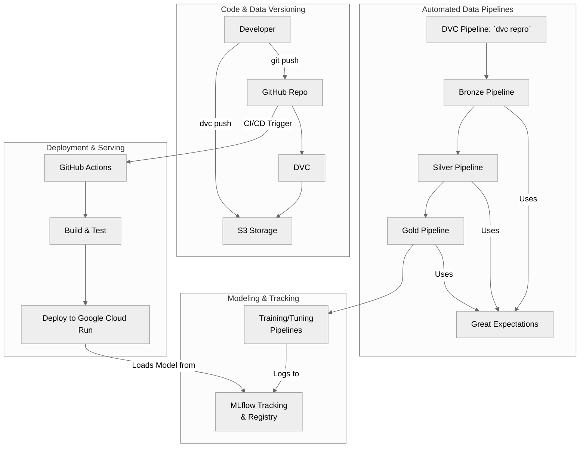

# ✈️ Flight Price Prediction MLOps Project

This project is a comprehensive, end-to-end MLOps pipeline for predicting flight prices. It leverages a modern stack of data and machine learning tools to build a reproducible, automated, and robust system that covers the entire lifecycle, from data ingestion and validation to model training, explainability, and serving.

## ✨ Features

-   **Data & Pipeline Versioning:** Uses **DVC** to version control data, models, and intermediate artifacts, ensuring full reproducibility.
-   **Declarative Pipeline Orchestration:** The entire ML pipeline is defined as code in `dvc.yaml`, allowing for robust, dependency-aware execution with a single command (`dvc repro`).
-   **Automated Data Validation:** Integrates **Great Expectations** at each pipeline stage (Bronze, Silver, Gold) to enforce data quality and prevent bad data from moving downstream.
-   **Experiment Tracking & Model Management:** Integrates **MLflow** for comprehensive experiment tracking, parameter logging, metric comparison, and model registration.
-   **Automated CI/CD**: Implements **GitHub Actions** for automated linting, testing, pipeline validation, and deployment to Google Cloud.
-   **Production-Ready API**: Includes a high-performance REST API built with **FastAPI** to serve the champion model, containerized with **Docker**.
-   **Reproducible Environment:** Project dependencies are managed with **`uv`** and locked in `requirements.lock` for fast, deterministic, and reproducible setups.

## 🏛️ Project Architecture

The architecture is designed to be modular and scalable, ensuring a robust workflow from data ingestion to model deployment.



*For a deeper dive, see the full [Architecture Documentation](docs/MLOps/architecture.md).*

## 🚀 Quickstart: Local Setup

Follow these steps to get the project running on your local machine.

### Prerequisites

-   Python 3.12+
-   [uv](https://github.com/astral-sh/uv): An extremely fast Python package installer and resolver.
-   [Git](https://git-scm.com/)
-   [DVC](https://dvc.org/doc/install)
-   [act](https://github.com/nektos/act) (Optional, for local CI/CD testing)

### 1. Clone the Repository

```bash
git clone https://github.com/your-username/Flights_Mlops.git
cd Flights_Mlops
```

### 2. Create Virtual Environment & Install Dependencies

This project uses `uv` for creating the environment and managing dependencies.

```bash
# Create and activate a virtual environment using uv
uv venv
source .venv/bin/activate
# On Windows: .\.venv\Scripts\activate

# Sync the environment with the lock file for a reproducible setup
uv pip sync requirements.lock
```

### 3. Get the Project Data

You have two options to get the data needed to run the pipelines.

#### Option A: Quick Local Start (No Credentials Needed)

This is the fastest way to get started. This project includes a Git-tracked archive with the initial raw data.

```bash
# Unzip the archive to get the initial flights.csv
unzip data/archieve-git-tracked/raw.zip -d data/raw/
```

This will place `flights.csv` in the `data/raw/` directory, which is all you need to run the `dvc repro` command for the initial data processing stages.

#### Option B: Full DVC Setup (Recommended for Complete Reproducibility)

To get all versioned data, models, and artifacts, you must configure DVC to connect to the remote S3-compatible storage.

```bash
# Configure the DVC remote endpoint URL and credentials.
# Replace the placeholders with your actual storage credentials.
dvc remote modify --local myremote endpointurl <YOUR_S3_ENDPOINT_URL>
dvc remote modify --local myremote access_key_id <YOUR_ACCESS_KEY_ID>
dvc remote modify --local myremote secret_access_key <YOUR_SECRET_ACCESS_KEY>

# Pull all DVC-tracked data and model artifacts
dvc pull -v
```

### 4. Running the Pipelines

You can run the project's pipelines in several ways, depending on your goal.

#### Method 1: Automated DAG Execution with DVC (Recommended)

This is the primary and recommended method for ensuring reproducibility. The `dvc.yaml` file orchestrates the entire workflow, and DVC automatically tracks dependencies.

```bash
# Run the entire pipeline from start to finish
dvc repro

# Or, run the pipeline up to a specific stage
dvc repro gold_pipeline
```

#### Method 2: Manual Script Execution (For Debugging)

For debugging or testing a single script in isolation, you can run the pipeline scripts directly. This bypasses DVC's dependency tracking.

**Using CLI Shortcuts:**

The project defines convenient shortcuts in `pyproject.toml`. After activating your virtual environment, you can use these commands:

```bash
# Run the Bronze pipeline on the training data
run-bronze-pipeline train.csv

# Run the Silver pipeline on the training data
run-silver-pipeline train.csv

# Run the Gold pipeline (processes all splits)
run-gold-pipeline

# Run the model training pipeline
run-training-pipeline
```

**Direct Python Execution:**

You can also call the scripts directly with Python:

```bash
python src/pipelines/bronze_pipeline.py train.csv
python src/pipelines/silver_pipeline.py train.csv
python src/pipelines/gold_pipeline.py
python src/pipelines/training_pipeline.py train.parquet validation.parquet
```

### 🔧 Configuring the Pipelines

The behavior of the pipelines can be customized without changing the source code.

#### High-Level Parameters (`params.yaml`)

This file is for controlling the overall strategy and hyperparameters.

-   **`is_tree_model`**: Set to `true` to use a streamlined preprocessing path for models like LightGBM, or `false` for a full path (including scaling, power transforms, etc.) for linear models.
-   **`gold_pipeline`**: Configure strategies for imputation, outlier handling, and more.
-   **`training_pipeline`**: The most important section for modeling. Change `model_config_to_run` to point to a different model configuration (e.g., `Ridge`, `XGBRegressor`) to train and evaluate a different model.

#### Low-Level Configuration (`src/shared/config/`)

This directory contains more static, developer-managed configurations.

-   **`core_paths.py`**: Defines all major file paths.
-   **`config_bronze.py`**, **`config_silver.py`**, **`config_gold.py`**: Contain settings specific to each pipeline layer, such as column lists for transformations, file names, and Great Expectations configuration names.

## 🤖 Local CI/CD Testing with `act`

You can run the GitHub Actions workflows locally using [act](https://github.com/nektos/act). This is incredibly useful for testing changes to your CI/CD pipeline without pushing to GitHub.

### Prerequisites

-   **Docker**: Must be installed and running.
-   **act**: Follow the [official installation guide](https://github.com/nektos/act?tab=readme-ov-file#installation) to install it.

### Setup

`act` needs access to the secrets used in your GitHub Actions workflows. Create a `.secrets` file in the project root and populate it with the necessary values.

**Example `.secrets` file:**

```ini
# These secrets are used in .github/workflows/ci.yml and cd.yml
# Populate them with your actual credentials for local testing.

# For MLflow connection
MLFLOW_AWS_ACCESS_KEY_ID=your_mlflow_aws_access_key
MLFLOW_AWS_SECRET_ACCESS_KEY=your_mlflow_aws_secret_key
MLFLOW_AWS_DEFAULT_REGION=your_mlflow_aws_region

# For DVC remote storage (e.g., Backblaze B2)
DVC_REMOTE_NAME=myremote
DVC_S3_ENDPOINT_URL=https://s3.us-west-000.backblazeb2.com
DVC_S3_ENDPOINT_REGION=us-west-000
B2_ACCESS_KEY_ID=your_b2_access_key
B2_SECRET_ACCESS_KEY=your_b2_secret_key

# For Google Cloud deployment (if testing CD)
GCP_SA_KEY=your_gcp_service_account_key_json_content
# ... add other secrets as needed
```

> **Warning:** The `.secrets` file contains sensitive information. It is already listed in `.gitignore` and should **never** be committed to version control.

### Usage

From the project root, you can run the following commands:

```bash
# Run the default `on: push` workflow
act

# Run a workflow triggered by a pull request
act pull_request

#To run a specific workflow
act -W .github/workflows/ci.yml
act -W .github/workflows/cd.yml

# Run a specific job from a workflow
act -j test_and_lint

# Run the CD workflow by simulating a tag push (with an event payload)
act push -W .github/workflows/cd.yml -e tag_push_event.json
```

## 📚 Project Documentation

This project is documented using MkDocs with the Material theme. To view the documentation locally, run:

```bash
mkdocs serve
```

Navigate to `http://127.0.0.1:8000` in your browser to see the full documentation site.