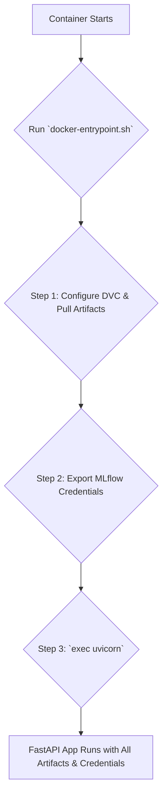

# 🚀 API Reference & Deployment Guide

This document provides a comprehensive technical reference for the FastAPI prediction server, including an in-depth analysis of its architecture, containerization, and cloud deployment workflow on Google Cloud.

-   **Source Code:** `src/prediction_server/`

## 🎯 Overview

The prediction server is a high-performance API built with **FastAPI** that serves the champion LightGBM model. It is designed with production best practices to provide low-latency, reliable flight price predictions.

Key architectural features include:

-   **Asynchronous by Default**: Built on FastAPI for high throughput.
-   **Robust Data Validation**: Uses **Pydantic** schemas to define a strict, self-documenting contract for all API requests and responses, preventing invalid data from ever reaching the model.
-   **Efficient Startup/Shutdown**: Loads the MLflow model and all DVC-tracked preprocessing artifacts into memory on startup to minimize prediction latency. These resources are gracefully released on shutdown.
-   **Decoupled Configuration**: The specific model to be served is managed in a dedicated configuration file, allowing for model updates without changing the application code.

## ⚙️ Core Components Analysis

The server's logic is modularized across several key files.

### `main.py`: The FastAPI Application

This is the core of the server. It uses a `lifespan` context manager to load all necessary ML artifacts into a global `ml_artifacts` dictionary upon startup. This is a crucial performance optimization, as it means the model and transformers are loaded only once, not on every prediction request.

### `schemas.py`: The Data Contract

This file defines the API's data contract using Pydantic. The `InputSchema` is particularly important, as it uses Python's `Enum` types for categorical features like `from_location` and `flight_type`. This provides automatic, built-in validation, ensuring that only valid categories are accepted by the API.

### `predict.py`: The Transformation Engine

This module is the bridge between raw API input and the model's required feature format.

1.  **`preprocessing_for_prediction`**: This function meticulously replicates the entire training pipeline. It takes the raw DataFrame from the API request and applies the exact same sequence of transformations (Silver and Gold steps) using the pre-loaded preprocessor objects. This guarantees that the data fed to the model at inference time has the exact same structure, encoding, and scale as the data it was trained on.
2.  **`postprocessing_for_target`**: Since the model predicts a transformed target (due to scaling and power transformations), this function reverses those steps. It takes the model's raw output and applies the inverse transformations from the `Scaler` and `PowerTransformer` objects to return a final price in its original, interpretable currency format.

### `model_loader.py`: Artifact Loading

This module is responsible for loading all ML assets.

-   `load_production_model()`: Connects to the **MLflow Tracking Server** using environment variables, and pulls the model specified by `MODEL_NAME` and `MODEL_VERSION_ALIAS` from the Model Registry.
-   `load_preprocessing_artifacts()`: Loads all the data transformers (imputer, encoder, scaler, etc.) that were fitted during the `gold_pipeline` run and saved by DVC.

## 📡 API Endpoints

### Health Check

-   **Endpoint:** `GET /`
-   **Description:** A simple health check to confirm that the API is running and responsive.
-   **Success Response (200):**

    ```json
    {
      "status": "ok",
      "message": "Welcome to the Flight Price Prediction API"
    }
    ```

### Prediction

-   **Endpoint:** `POST /prediction`
-   **Description:** The core endpoint that takes flight details, preprocesses them, runs the prediction, and returns the final estimated price.

#### Request Body (`InputSchema`)

The request body must be a JSON object conforming to the `InputSchema`.

```json
{
  "from_location": "Recife (PE)",
  "to_location": "Florianopolis (SC)",
  "flight_type": "firstClass",
  "time": 1.76,
  "distance": 676.53,
  "agency": "FlyingDrops",
  "date": "2019-09-26"
}
```

#### Success Response (200 - `OutputSchema`)

```json
{
  "predicted_price": 1434.35
}
```

## 🐳 Containerization & Execution

The server is containerized using a multi-stage `Dockerfile` for a lean and secure production image.

### The `docker-entrypoint.sh` Startup Logic

The container's startup process is managed by the entrypoint script, which performs critical setup *before* the FastAPI application starts. This two-step process is key to the server's architecture.



1.  **DVC Configuration & Pull**: The script first uses `DVC_*` and `B2_*` environment variables to configure DVC to connect to the S3-compatible remote storage. It then runs `dvc pull models` to download the fitted data transformers.
2.  **MLflow Credential Export**: Next, the script takes the `MLFLOW_*` environment variables and exports them as standard `AWS_*` credentials. The `exec "$@"` command then replaces the script process with the Uvicorn server process, which inherits these exported variables, allowing it to connect to the MLflow Tracking Server.

### Building and Running the Container

1.  **Build the Image**:
    From the project root, run:
```bash
docker build -t prediction-server:latest -f src/prediction_server/Dockerfile .
```

2.  **Run the Container**:
    Use an `.env` file (e.g., `prediction_app.env`) to securely manage your credentials.
```bash
docker run --env-file ./src/prediction_server/prediction_app.env -p 9000:9000 prediction-server:latest
```

    The API will be available at [http://localhost:9000/docs](http://localhost:9000/docs).

## ☁️ Cloud Deployment: Google Cloud Run

Deploying to Google Cloud Run provides a secure, scalable, and cost-effective serverless environment. The primary deployment is automated via the [CD workflow](cd.md).

### 🔑 Step 1: Secure Credentials with Google Secret Manager

Before deployment, all secrets (from your `.env` file) must be stored securely in **Google Secret Manager**. Each variable (`MLFLOW_TRACKING_URI`, `AWS_ACCESS_KEY_ID`, `B2_ACCESS_KEY_ID`, etc.) should be created as a separate secret.

### 👤 Step 2: Create a Dedicated Service Account

A best practice is to create a dedicated service account for the Cloud Run service with minimal permissions:

-   **Secret Manager Secret Accessor**: Allows it to read the secrets.
-   **Artifact Registry Reader**: Allows it to pull the container image.

### 🚀 Step 3: Deploy the Service

While this is automated in CI/CD, here is how to do it manually via the Google Cloud Console:

1.  Navigate to **Cloud Run** and click **"Create service"**.
2.  **Container Image**: Select the image you pushed to **Artifact Registry**.
3.  **Authentication**: Choose **"Require authentication"** for a private API.
4.  **Container Port**: Set to `9000`.
5.  **Autoscaling**: Set **Min instances** to `0` (to scale to zero) and **Max instances** to a reasonable number (e.g., `3`) to control costs.
6.  **Security Tab**: Attach the dedicated service account you created.
7.  **Variables & Secrets Tab**: This is the most critical step.
    -   For every environment variable your application needs, add a new variable.
    -   Choose **"Reference a secret"**, select the corresponding secret from Secret Manager, and use the `latest` version.
    -   **Do not enter any secrets in plain text.**
8.  Click **"Create"** to deploy.

Once deployed, Cloud Run provides a secure, public URL for your service. In a full production setup, this URL would be fronted by a **Google Cloud API Gateway** to handle API key authentication and rate limiting.