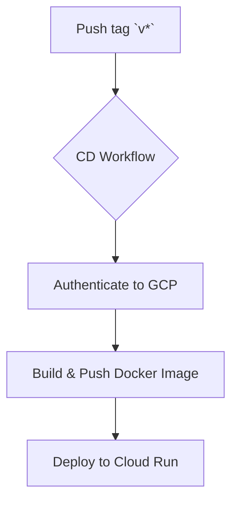

# 🚀 Continuous Deployment (CD) with GitHub Actions

This project uses GitHub Actions for Continuous Deployment to automate the release and deployment of the prediction server to **Google Cloud Run**. The workflow is defined in `.github/workflows/cd.yml`.

## 🎯 Trigger

The CD workflow is triggered automatically whenever a new **tag** matching the pattern `v*` (e.g., `v1.0`, `v1.1.0`) is pushed to the repository. This practice ensures that only specific, versioned releases are deployed to production.

## 🪜 Deployment Steps

1.  **Authenticate**: Authenticates to Google Cloud using a service account key stored in GitHub Secrets.

2.  **Configure Docker**: Configures the Docker client to push images to Google Artifact Registry.

3.  **Build and Push Image**: Builds the prediction server Docker image from `src/prediction_server/Dockerfile` and pushes it to the project's private Artifact Registry. The image is tagged with the Git tag from the release (e.g., `prediction-server:v1.0`).

4.  **Deploy to Cloud Run**: Deploys the newly pushed image to the specified Cloud Run service, which automatically creates a new, serving revision. The workflow also securely injects all necessary secrets (for DVC, MLflow, etc.) from Google Secret Manager into the running service environment.