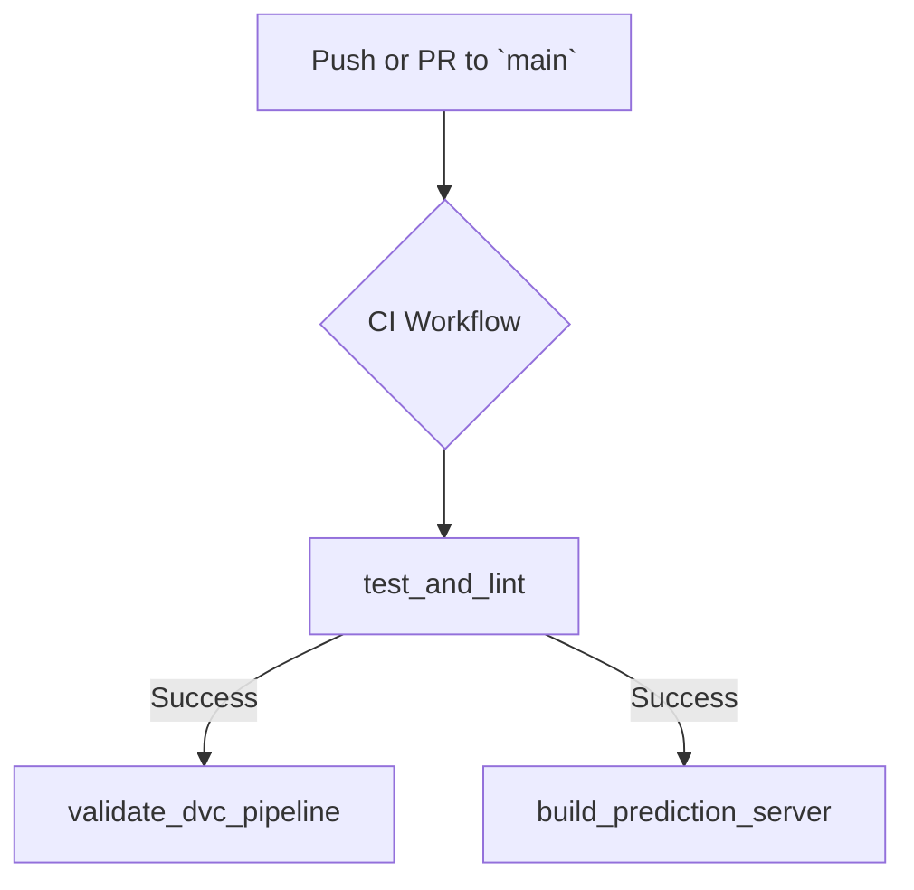

# 🛡️ Continuous Integration (CI) with GitHub Actions

This project uses GitHub Actions for Continuous Integration to automate quality checks and validate the integrity of the entire project on every code change.

The CI pipeline runs automatically on every push and pull request to the `main` branch. Its purpose is to provide rapid feedback and prevent errors from being merged into the main codebase. The workflow is defined in `.github/workflows/ci.yml`.

It consists of three main jobs that run in parallel after an initial setup:

### 🧪 1. `test_and_lint`

This is the first gate of quality control. It performs three critical checks:

-   **Linting**: Uses `ruff check .` to enforce code style and detect common errors.
-   **Formatting**: Uses `ruff format --check .` to ensure consistent code formatting.
-   **Unit Testing**: Executes the entire test suite with `pytest` to verify that individual components work as expected.

### ⛓️ 2. `validate_dvc_pipeline`

This job runs only after `test_and_lint` succeeds. It ensures the end-to-end data pipeline is reproducible and functional:

1.  **Configure Credentials**: Securely configures credentials for MLflow (AWS) and DVC (Backblaze B2) using GitHub Secrets.
2.  **Pull DVC Data**: Runs `dvc pull` to download the data, models, and artifacts required for the pipeline.
3.  **Reproduce Pipeline**: Executes `dvc repro` to run the entire DVC pipeline from start to finish. This is a crucial integration test that validates the data processing and model training stages defined in `dvc.yaml`.

### 🐳 3. `build_prediction_server`

This job also runs after `test_and_lint` and verifies that the prediction server's Docker image can be built successfully, catching any potential dependency or configuration issues early.