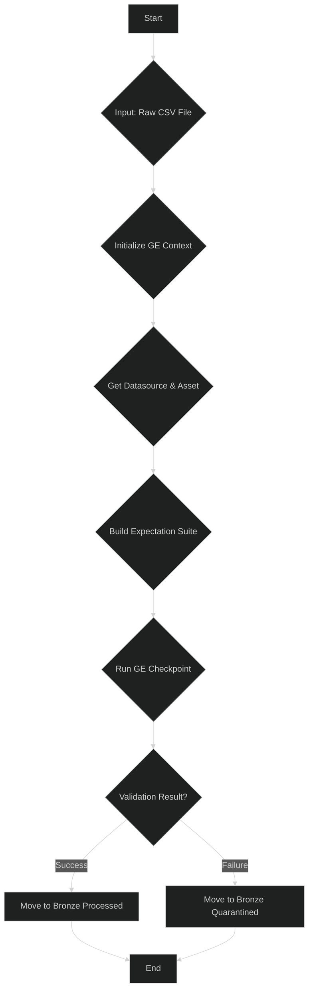

# Bronze Pipeline

The Bronze pipeline is the first entry point for raw data into the system. Its primary responsibility is to act as an initial quality gate, ensuring that incoming data conforms to a basic, expected schema and structure.

-   **Source Code:** `src/pipelines/bronze_pipeline.py`

## Purpose

-   To validate the structure and basic quality of raw data files using Great Expectations.
-   To separate valid data from invalid data, preventing "garbage in, garbage out."

## Pipeline Workflow



## Key Steps

1.  **Initialize Great Expectations (GE) Context**: Sets up the GE environment.
2.  **Define Data Source and Asset**: Points GE to the raw data directory and specifies how to read the CSV files.
3.  **Build and Apply Expectation Suite**: Uses the `build_bronze_expectations` suite to check for things like column presence, non-nullness, and basic type adherence.
4.  **Run Checkpoint**: Executes the validation.
5.  **Move File Based on Result**:
    -   **On Success**: Moves the raw file to the `data/bronze_data/processed/` directory.
    -   **On Failure**: Moves the raw file to the `data/bronze_data/quarantined/` directory.

## How to Run

After installing the project in editable mode (`pip install -e .`), you can use the CLI shortcut defined in `pyproject.toml`.

**Using CLI Shortcut:**

```bash
run-bronze-pipeline <file_name.csv>
```

**Example:**

```bash
run-bronze-pipeline train.csv
```

**Direct Execution:**

```bash
python src/pipelines/bronze_pipeline.py <file_name.csv>
```

## Configuration

The Bronze pipeline's behavior is configured through constants defined within the project's Python modules, primarily in `src/shared/config/config_bronze.py`. Key configurable parameters include:

-   **Paths**: Input directory for raw data (`RAW_DATA_SOURCE`), and output directories for processed (`BRONZE_PROCESSED_DIR`) and quarantined files (`BRONZE_QUARANTINE_DIR`).
-   **Great Expectations**: Names for the data source, asset, batch definition, expectation suite, and checkpoint.
-   **Logging**: The output path for log files (`BRONZE_PIPELINE_LOGS_PATH`) and the path to the `logging.yaml` configuration.

These are generally static configurations managed by developers within the codebase.

## Dependencies and Environment

-   **Key Libraries**: `great-expectations`, `pandas`, `pyyaml`, `python-json-logger`.
-   **Input Schema**: The pipeline expects raw CSV files. The exact schema is defined in the `BronzeExpectations` suite. A typical file is expected to contain columns related to flight details.

## Error Handling and Quarantining

-   **Process**: If the input file fails the Great Expectations validation checkpoint, the pipeline's execution is marked as failed. The `handle_file_based_on_validation` utility function moves the entire source file from the raw data directory to the quarantine directory (`data/bronze_data/quarantined/`).
-   **Debugging**: To debug a quarantined file, a developer should:
    1.  Check the pipeline's log file for details on the failure.
    2.  Inspect the Great Expectations Data Docs, which provide a detailed report on which specific expectation failed and why.
    3.  Manually examine the quarantined CSV file to find the offending data.
-   **Common Failure Reasons**:
    -   A column is missing, has been renamed, or is in the wrong order.
    -   Null values are present in a column that is expected to be non-null.
    -   The data type of a column does not match the expectation (e.g., a string appears in a numeric column).

---

## Next Steps

- [Silver Pipeline - Data Preprocessing & Validation &raquo;](silver_pipeline.md)
- [Gold Pipeline - Feature Engineering, Preprocessing & Validation &raquo;](gold_pipeline.md)
