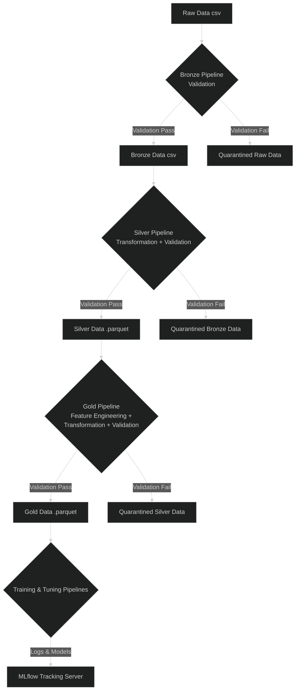

# 🌊 Data Pipelines

This document outlines the architecture of the data pipelines, which are designed to progressively process, validate, and enrich data. The project follows the **Medallion Architecture** (Bronze, Silver, Gold) to ensure data quality and traceability from raw source to model-ready features.

## 🏛️ The Medallion Architecture

This project adopts a layered approach to data processing, which provides a robust and maintainable workflow.

> **Key Benefits of this Architecture:**
> -   **Data Quality & Governance**: Each layer enforces increasingly strict quality standards, ensuring that business-critical data is reliable and well-documented.
> -   **Traceability & Debugging**: When an issue arises, it's easy to trace it back through the layers to pinpoint exactly where an error was introduced.
> -   **Idempotency & Reprocessing**: The separation of layers allows for efficient reprocessing. If a bug is found in the Gold pipeline, it can be fixed and re-run on the trusted Silver data without needing to re-ingest the raw source data.

### Core Technologies

-   **Great Expectations**: Acts as the primary data quality framework. It is used to define "expectation suites" at the end of each pipeline stage, acting as a quality gate that prevents bad data from moving to the next layer.
-   **Parquet**: The chosen storage format for the Silver and Gold data layers. As a columnar format, Parquet offers significant performance and storage efficiency advantages over row-based formats like CSV.

## 🗺️ End-to-End Pipeline Flow

The data flows through a series of DVC-orchestrated pipelines, with Great Expectations validating the output of each stage.

---

## 🧩 Pipeline Stages in Detail

### 🥉 Bronze Stage

The Bronze pipeline is the first quality gate for raw data. It validates the basic structure and schema of incoming files using Great Expectations, separating valid data from invalid data to ensure a reliable foundation for subsequent processing.

[**Learn more about the Bronze Pipeline &raquo;**](bronze_pipeline.md)

### 🥈 Silver Stage

The Silver pipeline focuses on cleaning and conforming the data. It takes validated Bronze data and applies transformations like standardizing formats, enriching features (e.g., from dates), and handling duplicates to create a clean, consistent, and queryable dataset.

[**Learn more about the Silver Pipeline &raquo;**](silver_pipeline.md)

### 🥇 Gold Stage

The Gold pipeline prepares the data for its final use case: machine learning. It applies complex feature engineering, imputation, encoding, and scaling transformations to the Silver data, producing a feature-rich, model-ready dataset.

[**Learn more about the Gold Pipeline &raquo;**](gold_pipeline.md)