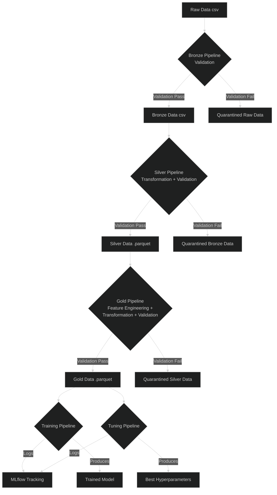

# Data Pipelines

This document outlines the architecture and execution of the data pipelines used in this project. The pipelines are designed to process, validate, and transform data in stages, following a medallion architecture (Bronze, Silver, Gold) before it is used for model training and tuning.

## Overall Pipeline Architecture

The data flows through a series of pipelines, each responsible for a specific level of data quality and transformation.

<!-- neutral, dark, default -->

### Key Technologies

-   **Great Expectations**: Acts as the primary data validation and quality control tool. It is used to define "expectation suites" at the end of the Bronze, Silver, and Gold pipelines, ensuring that the data meets specific quality standards before being promoted to the next layer. This prevents data quality issues from propagating downstream.

-   **Parquet**: The chosen storage format for the Silver and Gold data layers. As a columnar storage format, Parquet offers significant performance advantages and storage efficiency over row-based formats like CSV, which is especially beneficial for the wider, more complex datasets used in modeling.

### Design Principles: The Medallion Architecture

This project adopts the Medallion architecture (Bronze, Silver, Gold) to progressively refine data. This layered approach provides several key benefits:

-   **Data Quality and Governance**: Each layer enforces an increasing level of data quality. The Bronze layer validates the source, Silver cleans and conforms the data, and Gold prepares it for a specific, high-value use case (modeling). This ensures that business-critical datasets are reliable and well-documented.
-   **Traceability and Debugging**: When an issue arises in the final dataset, it's easy to trace it back through the layers. We can inspect the data at the Gold, Silver, and Bronze stages to pinpoint exactly where the error was introduced, dramatically simplifying debugging.
-   **Idempotency and Reprocessing**: The separation of layers allows for robust reprocessing. If a bug is found in the Gold pipeline's logic, we can fix it and re-run it on the trusted Silver data without needing to re-ingest and re-validate the raw source data. This saves significant time and computational resources.

---

## Pipeline Stages

### Bronze Stage

The Bronze pipeline is the first quality gate for raw data. It validates the basic structure and schema of incoming files using Great Expectations, separating valid data from invalid data to ensure a reliable foundation for subsequent processing.

[Learn more about the Bronze Pipeline &raquo;](bronze_pipeline.md)

### Silver Stage

The Silver pipeline focuses on cleaning and conforming the data. It takes validated Bronze data and applies transformations like standardizing formats, enriching features (e.g., from dates), and handling duplicates to create a clean, consistent, and queryable dataset.

[Learn more about the Silver Pipeline &raquo;](silver_pipeline.md)

### Gold Stage

The Gold pipeline prepares the data for its final use case: machine learning. It applies complex feature engineering, imputation, encoding, and scaling transformations to the Silver data, producing a feature-rich, model-ready dataset.

[Learn more about the Gold Pipeline &raquo;](gold_pipeline.md)

