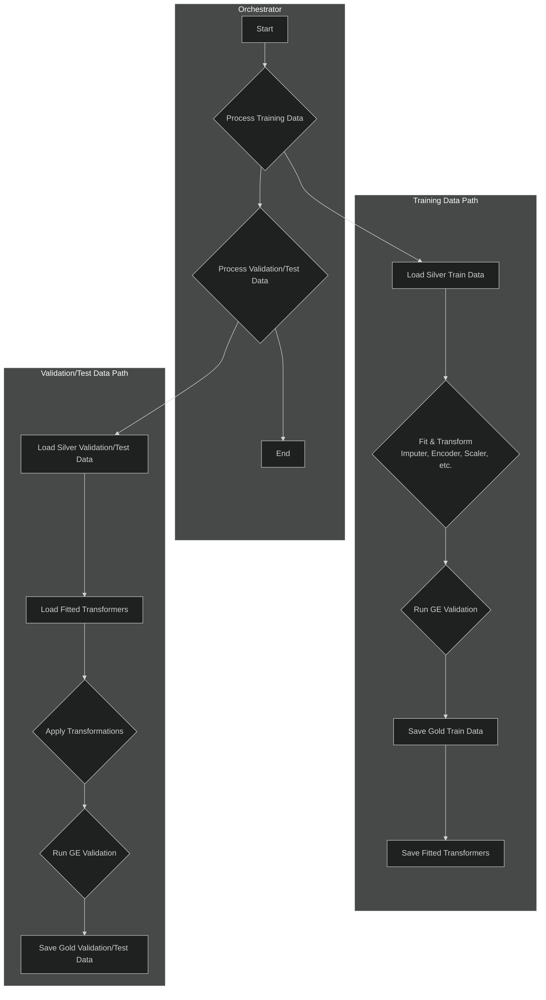

# Gold Pipeline

The Gold pipeline is the final and most intensive transformation stage. It prepares the data specifically for machine learning by applying complex feature engineering and preprocessing steps.

-   **Source Code:** `src/pipelines/gold_pipeline.py`

## Purpose

-   To create a feature-rich, analysis-ready dataset for modeling.
-   To handle missing values, encode categorical variables, scale numerical features, and manage outliers.
-   To save the fitted preprocessing objects (like scalers and encoders) from the training run so they can be applied to validation and test data consistently.

## Pipeline Workflow



## Key Steps

The pipeline is executed differently for training data versus validation/test data.

**On Training Data:**
1.  **Data Ingestion**: Loads data from the Silver layer.

2.  **Data Cleaning**: Drops unnecessary columns and duplicates.

3.  **Imputation**: Fits an imputer on the training data to learn strategies for filling missing values and then transforms the data.

4.  **Feature Engineering**: Creates cyclical and interaction features.

5.  **Rare Category Grouping**: Groups infrequent categorical values into a single "rare" category.

6.  **Categorical Encoding**: Fits an encoder and transforms categorical columns into a numerical format.

7.  **Outlier Handling**: Detects and mitigates the effect of outliers.

8.  **Power Transformations**: Applies transformations (e.g., Yeo-Johnson) to make data distributions more Gaussian-like.

9.  **Scaling**: Fits a scaler (e.g., StandardScaler) and scales numerical features.

10. **Final Validation**: Runs a `gold_expectations` suite to ensure the final data is ready for modeling.

11. **Save Data & Objects**: Saves the processed Gold data and serializes all the fitted preprocessing objects (imputer, encoder, scaler, etc.) to disk.

**On Validation/Test Data:**
- The pipeline loads the already-fitted preprocessing objects and uses them to `transform` the new data. This prevents data leakage and ensures consistent transformations.

## How to Run

The main function in the script orchestrates the processing for the `train`, `validation`, and `test` splits automatically.

**Using CLI Shortcut:**

```bash
run-gold-pipeline
```

**Direct Execution:**

```bash
python src/pipelines/gold_pipeline.py
```

## Configuration

The Gold pipeline uses a hybrid configuration approach:

-   **`params.yaml`**: This file stores parameters that are treated like hyperparameters for the pipeline itself. This includes strategies for imputation, outlier handling, scaling, and thresholds for grouping rare categories. These are intended to be easily tunable.
-   **`src/shared/config/config_gold.py`**: This stores more static, developer-managed configuration, such as lists of columns to be dropped, lists of columns to undergo specific transformations (e.g., `POWER_TRANSFORMER_COLUMNS`), and paths for saving processed data and fitted transformer objects.

## Dependencies and Environment

-   **Key Libraries**: `pandas`, `scikit-learn`, `great-expectations`.
-   **Input Schema**: The pipeline expects Parquet files from the `data/silver_data/processed/` directory, conforming to the schema produced by the Silver pipeline.

## Error Handling and Quarantining

-   **Process**: Similar to the Silver pipeline, if the final DataFrame fails the Gold validation checkpoint, it is saved to the quarantine directory (`data/gold_data/quarantined/`). The pipeline logs are particularly helpful here, as they print a summary of the failing expectations directly to the console.
-   **Debugging**:
    1.  Check the console output and log files for the summary of failing expectations.
    2.  For a deeper dive, consult the Great Expectations Data Docs.
    3.  Analyze the quarantined Parquet file to understand the data state that led to the failure.
-   **Common Failure Reasons**:
    -   A feature engineering step produced an unexpected result (e.g., `NaN` or `inf`).
    -   The final number of columns is incorrect, often due to an issue with categorical encoding.
    -   The distribution of a scaled feature is outside the expected range, indicating a potential problem with the source data or the scaling logic.
