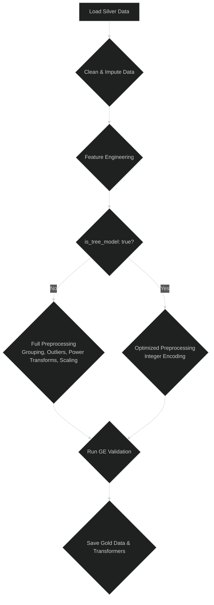

# 🥇 Gold Pipeline

The Gold pipeline is the final and most intensive transformation stage. It prepares the data specifically for machine learning by applying complex feature engineering and preprocessing steps.

-   **Source Code:** `src/pipelines/gold_pipeline.py`

## 🎯 Purpose

-   To create a feature-rich, analysis-ready dataset for modeling.
-   To handle missing values, encode categorical variables, and apply advanced transformations.
-   To provide a flexible workflow that can be optimized for different model architectures (e.g., linear models vs. tree-based models).
-   To save the fitted preprocessing objects (like scalers and encoders) from the training run so they can be applied consistently across all data splits.

## 🔄 Pipeline Workflow

The pipeline's workflow is dynamically adjusted based on the `is_tree_model` parameter in `params.yaml`. This allows for an optimized path for tree-based models like LightGBM.



## 🔑 Key Steps

The pipeline has two main execution paths, controlled by the `is_tree_model` parameter.

### Default Path (`is_tree_model: false`)

This path is designed for models that are sensitive to feature scale and distribution, such as linear models or SVMs.

1.  **Data Ingestion & Cleaning**: Loads and cleans data from the Silver layer.
2.  **Imputation**: Fills missing values based on the configured strategies.
3.  **Feature Engineering**: Creates cyclical and interaction features.
4.  **Rare Category Grouping**: Groups infrequent categorical values.
5.  **Categorical Encoding**: Transforms categorical columns into a numerical format (often One-Hot Encoding).
6.  **Outlier Handling**: Detects and mitigates the effect of outliers.
7.  **Power Transformations**: Applies transformations (e.g., Yeo-Johnson) to make data distributions more Gaussian-like.
8.  **Scaling**: Fits a scaler (e.g., StandardScaler) and scales numerical features.
9.  **Final Validation & Saving**: Runs a Great Expectations checkpoint and saves the data and fitted transformers.

### Optimized Tree Model Path (`is_tree_model: true`)

This streamlined path is used for tree-based models like LightGBM and XGBoost, which do not require extensive preprocessing.

1.  **Data Ingestion & Cleaning**: Same as the default path.
2.  **Imputation**: Same as the default path.
3.  **Feature Engineering**: Same as the default path.
4.  **Categorical Encoding**: Uses efficient integer-based encoding (e.g., `OrdinalEncoder`), which is handled natively by tree-based models.
5.  **Final Validation & Saving**: Runs a Great Expectations checkpoint and saves the data and fitted transformers.

**Skipped Steps:** In this path, **Rare Category Grouping, Outlier Handling, Power Transformations, and Scaling** are all bypassed, leading to a much faster and more efficient pipeline.

## ▶️ How to Run

The main function in the script orchestrates the processing for the `train`, `validation`, and `test` splits automatically.

**Using CLI Shortcut:**

```bash
run-gold-pipeline
```

**Direct Execution:**

```bash
python src/pipelines/gold_pipeline.py
```

## ⚙️ Configuration

The Gold pipeline uses a hybrid configuration approach:

-   **`params.yaml`**: This file stores parameters that are treated like hyperparameters for the pipeline itself. This includes strategies for imputation, outlier handling, scaling, and thresholds for grouping rare categories. A key parameter here is `is_tree_model`, which, when set to `true`, bypasses unnecessary steps like scaling and power transformations that are not required for tree-based models like LightGBM.
-   **`src/shared/config/config_gold.py`**: This stores more static, developer-managed configuration, such as lists of columns to be dropped, lists of columns to undergo specific transformations (e.g., `POWER_TRANSFORMER_COLUMNS`), and paths for saving processed data and fitted transformer objects.

## 📦 Dependencies and Environment

-   **Key Libraries**: `pandas`, `scikit-learn`, `great-expectations`.
-   **Input Schema**: The pipeline expects Parquet files from the `data/silver_data/processed/` directory, conforming to the schema produced by the Silver pipeline.

## 🐛 Error Handling and Quarantining

-   **Process**: Similar to the Silver pipeline, if the final DataFrame fails the Gold validation checkpoint, it is saved to the quarantine directory (`data/gold_data/quarantined/`). The pipeline logs are particularly helpful here, as they print a summary of the failing expectations directly to the console.
-   **Debugging**:
    1.  Check the console output and log files for the summary of failing expectations.
    2.  For a deeper dive, consult the Great Expectations Data Docs.
    3.  Analyze the quarantined Parquet file to understand the data state that led to the failure.
-   **Common Failure Reasons**:
    -   A feature engineering step produced an unexpected result (e.g., `NaN` or `inf`).
    -   The final number of columns is incorrect, often due to an issue with categorical encoding.
    -   The distribution of a scaled feature is outside the expected range, indicating a potential problem with the source data or the scaling logic.