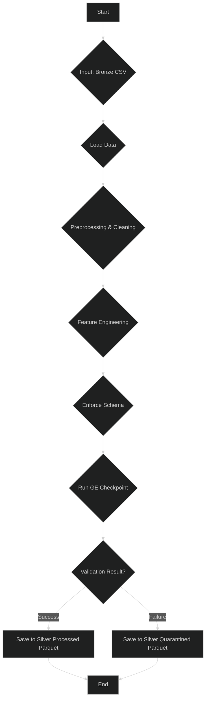

# 🥈 Silver Pipeline

The Silver pipeline takes the validated data from the Bronze layer and begins the process of cleaning, standardizing, and enriching it.

-   **Source Code:** `src/pipelines/silver_pipeline.py`

## 🎯 Purpose

-   To clean and standardize data.
-   To perform initial feature engineering, such as extracting features from dates.
-   To enforce a consistent schema and data types.

## 🔄 Pipeline Workflow



## 🔑 Key Steps

1.  **Data Ingestion**: Loads a file from the Bronze processed directory.
2.  **Preprocessing & Cleaning**:
    -   Renames columns for clarity.
    -   Standardizes column names to a consistent format (e.g., snake_case).
    -   Optimizes data types (e.g., converting strings to numeric/datetime).
    -   Sorts data by date to prepare for time-series analysis.
    -   Handles erroneous duplicates.
3.  **Feature Engineering**: Creates new features from existing ones (e.g., `day`, `month`, `year` from a `date` column).
4.  **Enforce Schema**: Reorders columns to a predefined, consistent order.
5.  **Data Validation**: Runs a `silver_expectations` suite with Great Expectations to ensure the output data meets higher quality standards.
6.  **Save Data**:
    -   **On Success**: Saves the processed DataFrame as a Parquet file to `data/silver_data/processed/`.
    -   **On Failure**: Saves the failed DataFrame to `data/silver_data/quarantined/`.

## ▶️ How to Run

**Using CLI Shortcut:**

```bash
run-silver-pipeline <bronze_file_name.csv>
```

**Example:**

```bash
run-silver-pipeline train.csv
```

**Direct Execution:**

```bash
python src/pipelines/silver_pipeline.py <bronze_file_name.csv>
```

## ⚙️ Configuration

Similar to the Bronze pipeline, configuration is managed in `src/shared/config/config_silver.py`.

-   **Paths**: Output directories for processed (`SILVER_PROCESSED_DIR`) and quarantined (`SILVER_QUARANTINE_DIR`) Parquet files.
-   **Schema**: The column rename mapping (`COLUMN_RENAME_MAPPING`), the expected final column order (`SILVER_EXPECTED_COLS_ORDER`), and expected data types (`SILVER_EXPECTED_COLUMN_TYPES`).
-   **Validation**: Column lists for non-null checks and identifying unique records.

## 📦 Dependencies and Environment

-   **Key Libraries**: `great-expectations`, `pandas`, `pyarrow`.
-   **Input Schema**: The pipeline expects a CSV file from the `data/bronze_data/processed/` directory, conforming to the schema validated by the Bronze pipeline.

## 🐛 Error Handling and Quarantining

-   **Process**: If the transformed DataFrame fails the Silver validation checkpoint, the `save_dataframe_based_on_validation` function saves the entire failing DataFrame as a Parquet file to the quarantine directory (`data/silver_data/quarantined/`).
-   **Debugging**:
    1.  Review the pipeline logs and Great Expectations Data Docs for specific failure reasons.
    2.  Load the quarantined Parquet file into a pandas DataFrame to analyze the data that caused the validation to fail.
-   **Common Failure Reasons**:
    -   An upstream change caused a data type to be inferred incorrectly.
    -   The cleaning or feature engineering logic introduced null values unexpectedly.
    -   Duplicate records were not handled as expected, violating a uniqueness constraint.

---

## ➡️ Next Steps

- [Gold Pipeline - Feature Engineering, Preprocessing & Validation &raquo;](gold_pipeline.md)