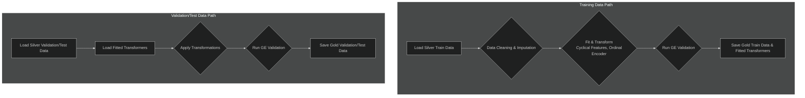

# LightGBM Production Model: Detailed Report

## 1. Executive Summary

This report provides a comprehensive overview of the final LightGBM model, which was selected as the **champion model** for the flight price prediction task after a rigorous process of evaluation, investigation, and refinement.

Initial modeling yielded a version that was suspiciously accurate. A deep-dive analysis revealed a subtle overfitting issue caused by a leaky feature (`route`). After correcting this, the final model emerged, demonstrating a superior combination of predictive accuracy and stability. It achieves a **Cross-Validation RMSE of $9.57** and a final **Test Set RMSE of $7.60**. This document details the model's final performance, parameters, and an in-depth analysis of its behavior.

## 2. Model Performance Metrics

The model's performance was validated through both rigorous cross-validation and a final evaluation on an unseen test set, confirming its stability and real-world predictive power.

### 2.1. Cross-Validation Performance (Mean over 5 Folds)

These metrics represent the model's average performance, demonstrating its stability and generalization capabilities.

| Metric | Value |
| :--- | :--- |
| **R² Score** | **0.99928** |
| **Root Mean Squared Error (RMSE)** | **$9.57** |
| **Mean Absolute Error (MAE)** | **$7.09** |
| **CV RMSE Standard Deviation** | **$0.43** |

### 2.2. Final Test Set Performance

These metrics represent the final, official performance of the trained model on a hold-out test set.

| Metric | Value |
| :--- | :--- |
| **R² Score** | **0.99956** |
| **Root Mean Squared Error (RMSE)** | **$7.60** |
| **Mean Absolute Error (MAE)** | **$5.50** |

## 3. Model Configuration and Parameters

### 3.1. Optimal Hyperparameters

The following hyperparameters were identified during the tuning phase and used for the final model.

| Parameter | Value |
| :--- | :--- |
| `n_estimators` | 700 |
| `learning_rate` | 0.1663 |
| `num_leaves` | 15 |
| `max_depth` | 5 |
| `subsample` | 0.8337 |
| `colsample_bytree` | 0.6145 |
| `reg_alpha` | 4.99e-05 |
| `reg_lambda` | 0.3305 |
| `random_state` | 42 |
| `n_jobs` | -1 |

### 3.2. Production Preprocessing Pipeline

Our final preprocessing pipeline is optimized for tree-based models by using the `is_tree_model: true` parameter. This streamlines the process and avoids unnecessary transformations.

**Key Optimizations:**

- **No Scaling or Power Transforms**: LightGBM is not sensitive to the scale or distribution of numerical features, so these steps were removed.
- **Integer Encoding**: We use integer-based encoding for categorical features, which is handled natively and efficiently by LightGBM.
- **Feature Selection**: The engineered `interation features` and later `route` feature was **explicitly removed** after being identified as a source of data leakage and overfitting. The model now relies on the fundamental `from_location` and `to_location` features.
- **Temporal Features**: Cyclical features for `month`, `day`, and `day_of_week` are included, as their signal is no longer masked by other features.

#### Optimized Pipeline Workflow

## 4. In-Depth Analysis of Model Behavior

### A. Prediction Accuracy (Actual vs. Predicted)

The Actual vs. Predicted plot shows a tight diagonal line, confirming the model's high precision.

-   **Insight:** The points are tightly clustered around the ideal 45-degree line, a visual confirmation of the high R² score and low error rates.

### B. Error Analysis (Residuals vs. Predicted)

The residuals plot is healthy, showing a random and unbiased distribution of errors.

-   **Insight:** The errors are clustered around the zero-line with no discernible patterns. This is the picture of a healthy, well-behaved model with no systematic biases.

### C. Normality of Residuals (Q-Q Plot)

The Q-Q plot shows that the model's errors are very close to a normal distribution.

-   **Insight:** The points follow the red line well, indicating that the error distribution is largely normal, which is a sign of a well-calibrated model.

### D. Feature Importance Analysis
-   **Check out the model explainability document for shap analysis for feature importance.**
-   **Top Influencers:** **`time`** (flight duration), **`locations`**, **`agency` and  **`flight_type`** remain the most dominant predictors.
-   **Re-emergence of Temporal Features:** Crucially, the cyclical features for **`day_of_week`** and **`day`** now appear to have some level of importance. Their signal was previously being masked by the overfitting engineered features.
-   **Actionable Insight:** The model has learned a robust hierarchy of what drives price: flight duration, location, agency,  service class, and specific temporal patterns.

## 5. Final Verdict: A True Champion

After a thorough investigation, we can confidently declare this LightGBM model as the champion. The initial, suspiciously perfect model was correctly identified as overfit. By diagnosing the problem and correcting it, we have produced a final model that is not only highly accurate but also **stable, robust, and reliable**.

The consistency between its cross-validation performance (CV RMSE: **$9.57**) and its final test set performance (Test RMSE: **$7.60**) is the key piece of evidence that it generalizes well to new, unseen data.

---

## Next Steps

This model is ready for production. The next steps involve deploying it as a service and monitoring its performance over time.

* **[Deep Dive into the Champion Model's Explainability &raquo;](../Modeling/model_explainability_lgbm_champ.md)**

