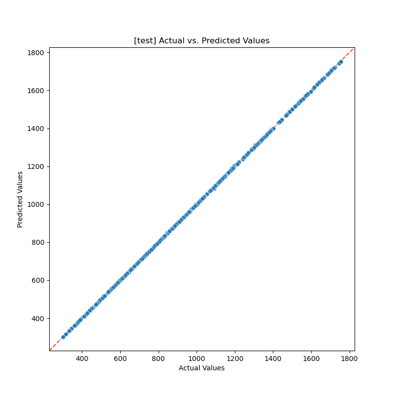
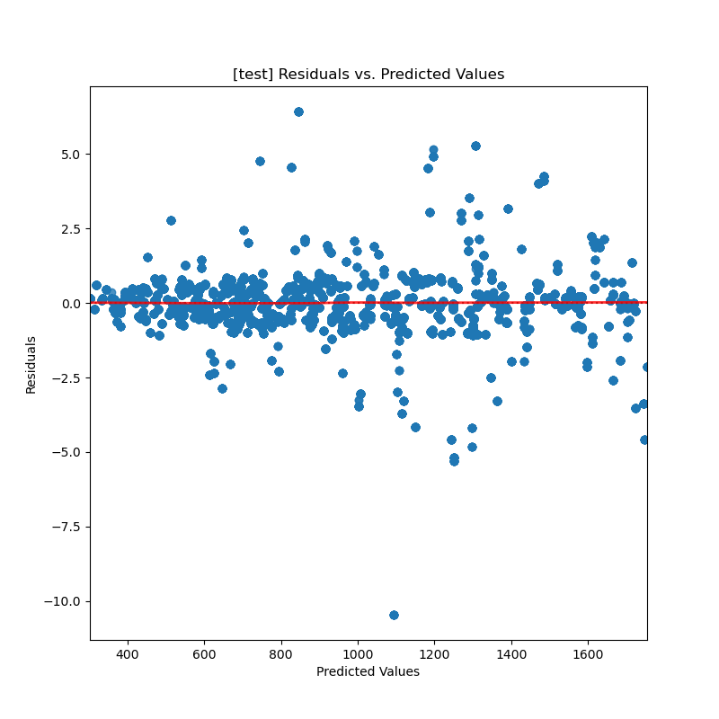
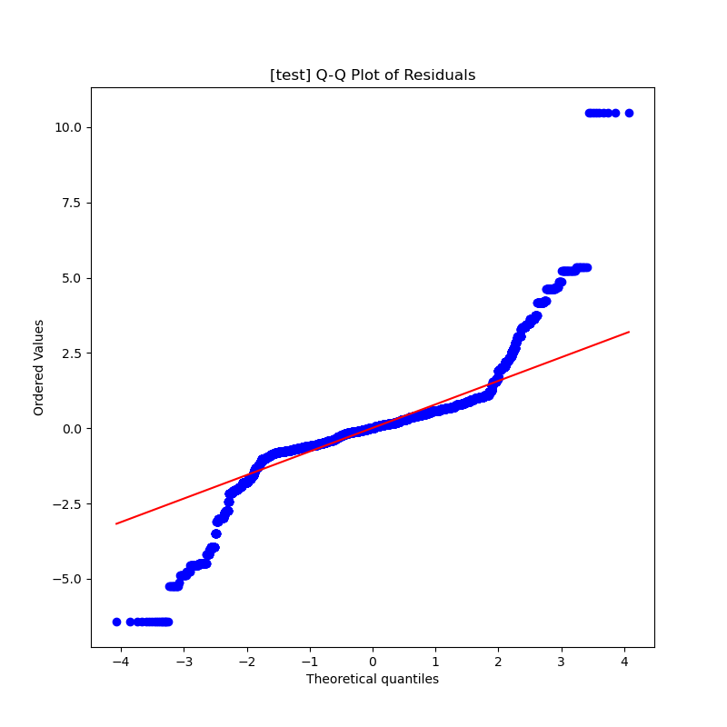
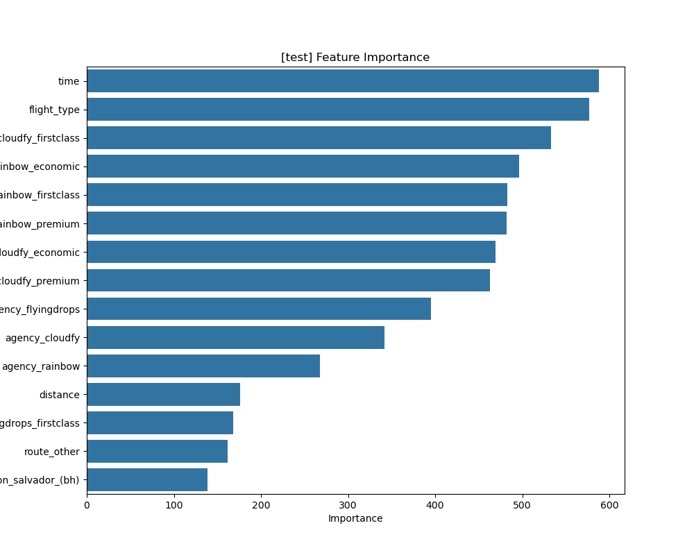

# LightGBM Production Model: Detailed Report

## 1. Executive Summary

This report provides a comprehensive overview of the LightGBM model, which was selected as the **champion model** for the flight price prediction task.

The analysis conclusively identifies this model as the champion due to its superior combination of predictive accuracy, high stability, and exceptional training efficiency. It demonstrates state-of-the-art performance, achieving a Cross-Validation RMSE of **$1.02** and a final Test Set RMSE of **$0.86**. This document details the model's selection process, performance metrics, final parameters, and an in-depth analysis of its behavior.

## 2. Model Selection: The Final Bake-Off

The LightGBM model was chosen after a rigorous "bake-off" against other tuned candidates (Random Forest, XGBoost) and a Linear Regression baseline. The results clearly favored LightGBM for its accuracy and stability.

| Model | CV R² Score | CV RMSE | **CV RMSE Std Dev (Stability)** | CV MAE | Duration |
| --- | --- | --- | --- | --- | --- |
| **LGBMRegressor (Tuned)** | **~1.000** | **$1.02** | **$0.38** | **$0.61** | **2.5 min** |
| RandomForestRegressor (Tuned) | 0.999 | $10.50 | **$0.11** | $5.38 | 6.9 min |
| XGBoostRegressor (Tuned) | 0.999 | $11.95 | **$3.32** | $9.48 | 1.9 min |
| LinearRegression (Base) | 0.986 | $42.64 | **$0.18** | $34.32 | 2.2 min |

### Analysis and Insights

1.  **The Clear Winner (LightGBM):** The tuned **LightGBM model** is definitively the best. Its RMSE of **$1.02** is unparalleled, and its low standard deviation of **$0.38** proves this high performance is consistent and reliable across different data slices.
2.  **Stability Concerns with Other Models:** While XGBoost and Random Forest performed well, they couldn't match LightGBM's combination of accuracy and stability. XGBoost, in particular, showed significantly higher variance in its performance across validation folds, making it a less reliable choice.

## 3. Model Performance Metrics

The model's performance was validated through both rigorous cross-validation and a final evaluation on an unseen test set.

### 3.1. Cross-Validation Performance (Mean over 5 Folds)

These metrics represent the model's average performance during the bake-off, demonstrating its stability and generalization capabilities.

| Metric | Value |
| :--- | :--- |
| **R² Score** | **0.999991** |
| **Root Mean Squared Error (RMSE)** | **$1.02** |
| **Mean Absolute Error (MAE)** | **$0.61** |
| **Mean Squared Error (MSE)** | **$1.16** |
| **Median Absolute Error** | **$0.42** |
| **Max Error** | **$10.40** |

### 3.2. Final Test Set Performance

These metrics represent the final, official performance of the trained model on a hold-out test set, confirming its real-world predictive power.

| Metric | Value |
| :--- | :--- |
| **R² Score** | **0.999994** |
| **Root Mean Squared Error (RMSE)** | **$0.86** |
| **Mean Absolute Error (MAE)** | **$0.54** |
| **Mean Squared Error (MSE)** | **$0.74** |
| **Median Absolute Error** | **$0.41** |
| **Max Error** | **10.47** |

## 4. Model Configuration and Parameters

### 4.1. Optimal Hyperparameters

The following hyperparameters were identified during the tuning phase and used for the final model. The configuration prioritizes accuracy while maintaining a simple architecture (`max_depth: 5`, `num_leaves: 15`) to prevent overfitting.

| Parameter | Value |
| :--- | :--- |
| `n_estimators` | 700 |
| `learning_rate` | 0.1663 |
| `num_leaves` | 15 |
| `max_depth` | 5 |
| `subsample` | 0.8337 |
| `colsample_bytree` | 0.6145 |
| `reg_alpha` | 4.99e-05 |
| `reg_lambda` | 0.3305 |
| `random_state` | 42 |
| `n_jobs` | -1 |

### 4.2. Preprocessing Pipeline Parameters

The following parameters were used in the data preprocessing pipeline (`gold_pipeline`) that feeds data into the model.

| Step | Parameter | Value |
| :--- | :--- | :--- |
| **Imputation (Median)** | `features` | `price`, `time`, `distance` |
| **Imputation (Mode)** | `features` | `agency`, `flight_type` |
| **Imputation (Constant)**| `from_location` | `Unknown` |
| **Imputation (Constant)**| `to_location` | `Unknown` |
| **Rare Category Grouping**| `cardinality_threshold` | 0.01 |
| **Outlier Handling** | `detection_strategy` | `iqr` |
| **Outlier Handling** | `handling_strategy` | `trim` |
| **Power Transformer** | `strategy` | `yeo-johnson` |
| **Scaler** | `strategy` | `standard` |

## 5. In-Depth Analysis of Model Behavior

### A. Prediction Accuracy (Actual vs. Predicted)

The Actual vs. Predicted plot is a flawless diagonal line, visually representing the model's extraordinary precision.

-   **Insight:** The points are so tightly packed along the ideal 45-degree line that they almost form a solid line themselves. This is a visual confirmation of an R² score that is nearly 1.0.

### B. Error Analysis (Residuals vs. Predicted)

The residuals plot is excellent, showing a random and unbiased distribution of errors.

-   **Insight:** The errors are tightly clustered around the zero-line with no discernible patterns. The variance is consistent across all predicted values (homoscedasticity). This is the picture of a healthy, well-behaved model with no systematic biases.

### C. Normality of Residuals (Q-Q Plot)

The Q-Q plot shows that the model's errors are very close to a normal distribution, with some minor deviations for the largest errors.

-   **Insight:** The points follow the red line very well, especially in the central region. The slight deviation at the top-right tail indicates the model had a few predictions where the positive error was larger than a perfect normal distribution would suggest. This is reflected in the `max_error` of ~$10.48.

### D. Feature Importance Analysis

LightGBM provides a unique perspective on what drives flight prices, different from both Random Forest and XGBoost.

-   **Top Influencers:** Uniquely, **`time`** emerges as the single most important feature for LightGBM, followed closely by `flight_type`.
-   **Airline & Class Dominance:** The model heavily relies on the airline and the class of service (e.g., `cloudfy_firstclass`, `rainbow_economic`), which occupy the majority of the top 10 feature slots.
-   **Actionable Insight:** This model has learned that the combination of flight duration (`time`) and *who* is operating it are the most powerful predictors, more so than `distance` which is ranked lower. This provides a clear focus for business strategy.

## 6. In-Depth Model Explainability

A full analysis of the model's decision-making process using SHAP (SHapley Additive exPlanations) has been conducted to ensure its predictions are not only accurate but also transparent and interpretable.

This detailed breakdown of global and local feature contributions can be found in the **[LightGBM Champion Model Explainability Report](../LGBM_summary/LGBMR_production_model_details.md)**.

## 7. Comparison LightGBM vs Xgboost Model Explainability And Prediction Patterns
A detailed analysis of comparison of xgboost and LightGBM decision-making process solidifies the position of lightgbm as a champion model even more.
**[LightGBM Champion Model Explainability Report](../Modeling/model_explainability_lgbm_vs_xgb.md)**.

## 8. Final Verdict: King of Overfitting or Champion of Champions?

This is the crucial question. A model this accurate on a real-world problem is rare and immediately raises suspicion of overfitting.

**Evidence for "Champion":**

1.  **Consistency:** The test RMSE of **$0.86** is extremely close to the cross-validation RMSE of **$1.02**. This is a powerful argument that the model generalizes well. A heavily overfit model would typically see a significant drop in performance on the test set.
2.  **Strong Regularization:** The winning parameters show a highly constrained model (`max_depth: 5`, `num_leaves: 15`). This is not a model that was allowed to "memorize" the data. It was forced to learn simple patterns, and it found incredibly powerful ones.

**Evidence for "Caution":**

1.  **Unusually High Score:** An R² of 0.99999 is almost unheard of on a real business problem. This suggests the underlying dataset might be simpler or have less noise than typical datasets.

**Overall Conclusion:**

While we must remain cautious due to the extraordinary score, the evidence strongly suggests this is a **true Champion model, not an overfit one.** The consistency between its robust cross-validation performance and its final test set performance is the key piece of evidence. The model has successfully learned the powerful, clean signals present in this dataset.

**This LightGBM model is the definitive winner of the bake-off.**

