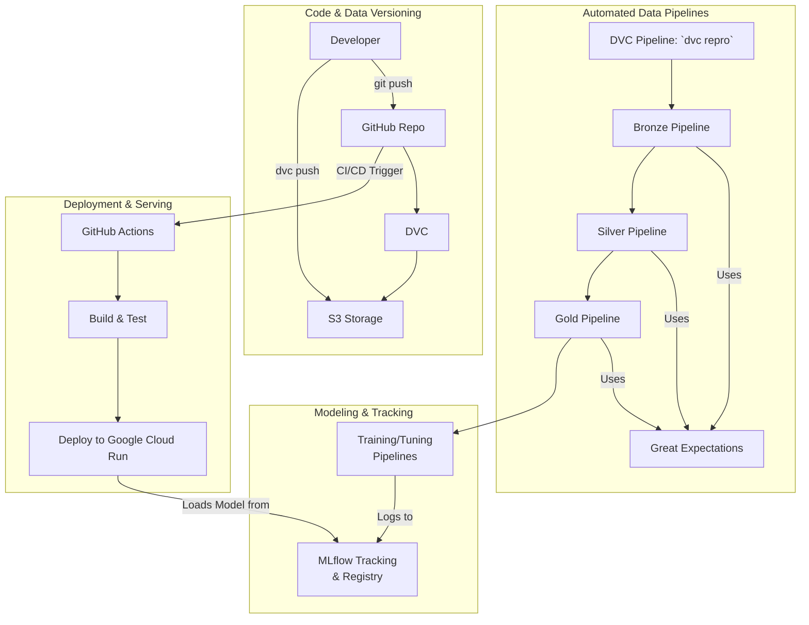

# 🏛️ Project Architecture

This document outlines the MLOps architecture for the flight price prediction project. The architecture is designed to be modular, scalable, and reproducible, ensuring a robust workflow from data ingestion to model deployment.

## 🗺️ High-Level Overview

The architecture is composed of four main pillars:

1.  **Code & Data Versioning**: The foundation for reproducibility.
2.  **Automated Pipelines**: For data processing and validation.
3.  **Modeling & Tracking**: For experimentation and model management.
4.  **CI/CD & Deployment**: For automated testing, validation, and serving.

## 🧩 Component Breakdown

### 💾 1. Code & Data Versioning

-   **Developer**: The user who writes code, runs experiments, and manages the project.
-   **GitHub**: The central repository for all source code, documentation, and DVC metadata files. It acts as the single source of truth for the project's logic.
-   **DVC (Data Version Control)**: Used to version large files (datasets, models, artifacts) that cannot be stored in Git. DVC creates small metadata files that point to the actual data stored in a remote location.
-   **S3 Storage**: The remote storage backend for DVC. All large files versioned by DVC are stored here.

### ⚙️ 2. Automated Data Pipelines

-   **DVC Pipelines**: The primary orchestration tool is DVC itself. The `dvc.yaml` file defines the stages of the pipeline (Bronze, Silver, Gold), their dependencies, and outputs. Running `dvc repro` executes the entire workflow, ensuring reproducibility and only re-running stages where inputs have changed.
-   **Bronze, Silver, Gold Pipelines**: These are the sequential stages of data processing, following the Medallion Architecture to progressively clean, transform, and enrich the data.
-   **Great Expectations**: The data quality framework integrated into each data pipeline. It validates the data at each stage, ensuring that only high-quality data proceeds to the next step.

### 🎯 3. Modeling & Tracking

-   **Training/Tuning Pipelines**: These are Python scripts responsible for model training and hyperparameter tuning. They consume the model-ready data from the Gold pipeline.
-   **MLflow**: The core of the experimentation process. It is used to:
    -   **Track Experiments**: Log parameters, metrics, and artifacts for every training and tuning run.
    -   **Manage Models**: Store the best models in the MLflow Model Registry, providing versioning and stage management (e.g., Staging, Production).

### 🚀 4. CI/CD & Deployment

-   **GitHub Actions**: The automation engine for CI/CD.
    -   **Continuous Integration**: On every push/PR to `main`, workflows automatically lint, test, and validate the entire DVC pipeline. See the [CI Documentation](ci.md) for details.
    -   **Continuous Deployment**: On git tags (e.g., `v1.0`), workflows automatically build the prediction server image and deploy it to Google Cloud Run. See the [CD Documentation](cd.md) for details.
-   **FastAPI & Docker**: The final, champion model from the MLflow Registry is served via a high-performance FastAPI application. This application is containerized with Docker for portability and scalable deployment on Google Cloud Run.