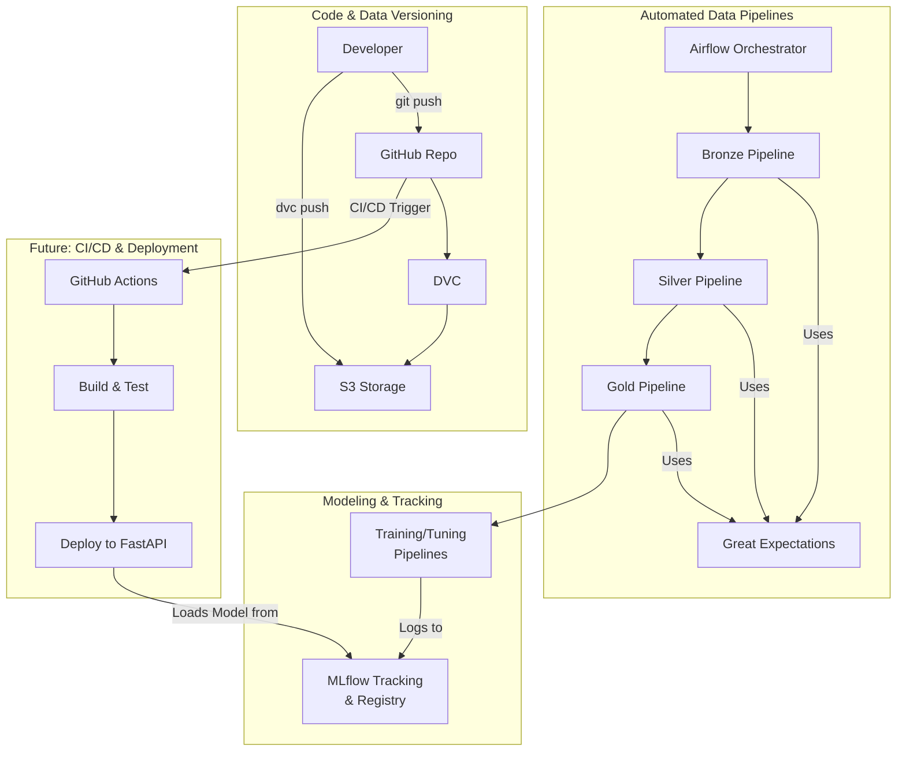

# Project Architecture

This document outlines the MLOps architecture for the flight price prediction project. The architecture is designed to be modular, scalable, and reproducible, ensuring a robust workflow from data ingestion to model deployment.

## High-Level Overview

The architecture is composed of four main pillars: 
1.  **Code & Data Versioning**: The foundation for reproducibility.
2.  **Automated Pipelines**: For data processing and validation.
3.  **Modeling & Tracking**: For experimentation and model management.
4.  **CI/CD & Deployment**: For continuous integration, delivery, and serving (future work).

## Component Breakdown

### 1. Code & Data Versioning

-   **Developer**: The user who writes code, runs experiments, and manages the project.
-   **GitHub**: The central repository for all source code, documentation, and DVC metadata files. It acts as the single source of truth for the project's logic.
-   **DVC (Data Version Control)**: Used to version large files (datasets, models, artifacts) that cannot be stored in Git. DVC creates small metadata files that point to the actual data stored in a remote location.
-   **S3 Storage**: The remote storage backend for DVC. All large files versioned by DVC are stored here.

### 2. Automated Data Pipelines

-   **Apache Airflow**: The workflow management system used to orchestrate the data pipelines. It ensures that the Bronze, Silver, and Gold pipelines are executed in the correct order and handles scheduling and dependency management.
-   **Bronze, Silver, Gold Pipelines**: These are the sequential stages of data processing, following the Medallion Architecture to progressively clean, transform, and enrich the data.
-   **Great Expectations**: The data quality framework integrated into each data pipeline. It validates the data at each stage, ensuring that only high-quality data proceeds to the next step.

### 3. Modeling & Tracking

-   **Training/Tuning Pipelines**: These are Python scripts responsible for model training and hyperparameter tuning. They consume the model-ready data from the Gold pipeline.
-   **MLflow**: The core of the experimentation process. It is used to:
    -   **Track Experiments**: Log parameters, metrics, and artifacts for every training and tuning run.
    -   **Manage Models**: Store the best models in the MLflow Model Registry, providing versioning and stage management (e.g., Staging, Production).

### 4. Future: CI/CD & Deployment

-   **GitHub Actions**: This will be used to create a Continuous Integration/Continuous Delivery (CI/CD) pipeline. On every push to the main branch, it will automatically run tests, validate code, and potentially trigger a model retraining or deployment pipeline.
-   **FastAPI & Docker**: The final, champion model from the MLflow Registry will be served via a high-performance FastAPI application, containerized with Docker for scalability and portability.
