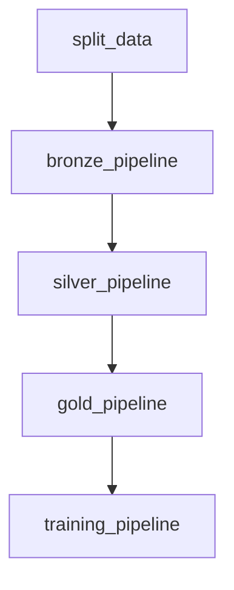

# ⛓️ DVC Pipeline Orchestration

This document provides a detailed breakdown of the `dvc.yaml` file, which acts as the central orchestrator for the entire data processing and model training workflow in this project.

## 🗺️ Overview

The `dvc.yaml` file defines a Directed Acyclic Graph (DAG) of all the stages in our project. Each stage has defined inputs (dependencies), outputs, and the command to execute. This structure allows DVC to intelligently manage the workflow.

When you run `dvc repro`, DVC checks if any of the dependencies have changed since the last run. If they have, it re-executes the affected stage and all subsequent stages that depend on its output. This ensures **reproducibility** and **efficiency**, as only necessary computations are performed.

## 📊 Pipeline Visualization

The end-to-end pipeline defined in `dvc.yaml` follows this sequence:



## 🧩 Stage Breakdown

Here is a detailed look at each stage defined in `dvc.yaml`.

### 1. `split_data`

-   **Purpose**: Takes the single raw dataset (`flights.csv`) and splits it into `train`, `validation`, and `test` sets to ensure a consistent data division for all subsequent steps.
-   **Command**: `python src/data_split/split_data.py`
-   **Dependencies**: The main dependency is the raw `data/raw/flights.csv` file and the splitting script itself.
-   **Outputs**: The `data/raw/train_validation_test` directory, which contains the three new CSV files.

### 2. `bronze_pipeline`

-   **Purpose**: Acts as the first quality gate. It runs the Bronze data validation pipeline on each of the data splits.
-   **Command**: `python src/pipelines/bronze_pipeline.py ${item}.csv`
-   **Special Logic**: This stage uses a `foreach` loop over the `data_splits` variable (defined in `params.yaml`). This means it executes three times, once for each of the `train`, `validation`, and `test` files.
-   **Dependencies**: The corresponding raw data split (e.g., `train.csv`) and the Bronze pipeline source code.
-   **Outputs**: A validated CSV file in the `data/bronze_data/processed/` directory for each split.

### 3. `silver_pipeline`

-   **Purpose**: Cleans, standardizes, and performs initial feature engineering on the validated Bronze data.
-   **Command**: `python src/pipelines/silver_pipeline.py ${item}.csv`
-   **Special Logic**: Like the Bronze stage, this also uses a `foreach` loop to process each data split independently.
-   **Dependencies**: The corresponding processed Bronze file and the Silver pipeline source code.
-   **Outputs**: A processed Parquet file in the `data/silver_data/processed/` directory for each split.

### 4. `gold_pipeline`

-   **Purpose**: The final and most complex data transformation stage. It applies advanced feature engineering and preprocessing to prepare the data for machine learning.
-   **Command**: `python src/pipelines/gold_pipeline.py`
-   **Dependencies**: All three processed Parquet files from the Silver layer (`train.parquet`, `validation.parquet`, `test.parquet`).
-   **Parameters (`params`)**: This stage is sensitive to parameters defined in `params.yaml` under the `gold_pipeline` key. This allows for tuning the preprocessing steps (e.g., imputation strategy, outlier handling) without changing the code.
-   **Outputs**: The model-ready datasets in `data/gold_engineered_data/processed/` and all fitted data transformers (scalers, encoders, etc.) in the `models/` directory.

### 5. `training_pipeline`

-   **Purpose**: Executes the model training, evaluation, and logging workflow.
-   **Command**: `python src/pipelines/training_pipeline.py train.parquet validation.parquet --test_file_name test.parquet`
-   **Dependencies**: The final processed data from the Gold layer.
-   **Parameters (`params`)**: This stage's behavior is heavily controlled by the `training_pipeline` and `mlflow_params` sections in `params.yaml`. This is where you can specify which model to run, its hyperparameters, and whether to perform cross-validation.
-   **Outputs**: This stage does not produce DVC-tracked file outputs. Instead, its primary outputs are the experiments, metrics, and model artifacts logged to the **MLflow Tracking Server**.

## ▶️ How to Run the Pipeline

-   **Run the entire pipeline**: To execute all stages in order, from start to finish, run:
```bash
dvc repro
```

-   **Run a specific stage**: To run the pipeline up to and including a specific stage, use its name. For example, to run everything through the `gold_pipeline`:
```bash
dvc repro gold_pipeline
```

-   **Visualize the pipeline**: To see a text-based representation of the DAG in your terminal, run:
```bash
dvc dag
```