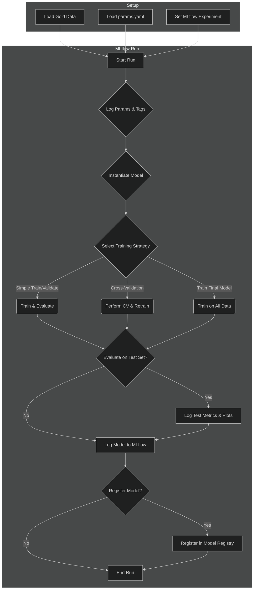

# Training Pipeline

The Training Pipeline is responsible for training, evaluating, and logging machine learning models using the processed data from the Gold layer. It is highly configurable and deeply integrated with MLflow for experiment tracking and model management.

-   **Source Code:** `src/pipelines/training_pipeline.py`

## Purpose

-   To train machine learning models on the clean, feature-rich Gold dataset.
-   To systematically evaluate model performance using different strategies (simple validation or cross-validation).
-   To log all relevant information to MLflow, including parameters, metrics, artifacts (like plots and predictions), and the final model itself.
-   To provide a flexible framework for experimenting with different models and hyperparameters.

## Pipeline Workflow

The pipeline executes a series of steps, from data loading to model registration, all tracked within a single MLflow run.



## Key Stages

The pipeline is divided into five main stages, executed sequentially:

1.  **Configuration & Setup**:
    -   Loads the main `params.yaml` file.
    -   Selects the active model configuration based on the `model_config_to_run` key.
    -   Sets the MLflow experiment name, creating it if it doesn't exist.

2.  **Data Preparation**:
    -   Loads the training, validation, and (optional) test datasets from the `data/gold_data/processed/` directory.
    -   Separates features (X) from the target variable (y).
    -   Drops any specified multicollinear columns to prevent issues with certain models.
    -   Loads the fitted `Scaler` and `PowerTransformer` objects, which are essential for unscaling predictions to their original magnitude for evaluation.

3.  **Model Training & Validation**:
    -   This is the core of the pipeline, executed within an MLflow run context.
    -   **MLflow Setup**: Autologging is enabled based on the model's library (e.g., `sklearn`, `xgboost`), and all parameters from `params.yaml` are logged.
    -   **Model Instantiation**: The model is created using the class and hyperparameters defined in the active configuration.
    -   **Training Strategy**: Based on the configuration, one of three paths is taken:
        -   **Simple Validation**: The model is trained on the training set and evaluated on both the training and validation sets.
        -   **Cross-Validation**: Time-based cross-validation is performed on the combined training and validation data, results are logged, and a final model is retrained on the full combined dataset.
        -   **Train Final Model**: The model is trained on the combined training and validation data without any intermediate evaluation. This is typically used for producing the final production artifact.

4.  **Final Evaluation on Test Set**:
    -   If `evaluate_on_test_set` is enabled in the configuration, the final trained model is evaluated against the hold-out test set.
    -   All metrics and plots for the test set are logged to MLflow, prefixed with `test/`.

5.  **Model Logging & Registration**:
    -   If `log_model_artifact` is true, the final trained model object is logged to the MLflow run.
    -   If `register_model` is also true, the logged model is registered in the MLflow Model Registry with the specified model name, creating a new version.

## Configuration

The pipeline's behavior is almost entirely controlled by `params.yaml`, providing a centralized place for all settings.

-   **`training_pipeline.model_config_to_run`**: This is the master key that determines which model configuration to use from the `models` dictionary.
-   **`training_pipeline.models.<YourModel>`**: Each entry in this dictionary defines a complete training run:
    -   `model_class`: The Python class name of the model (e.g., `LGBMRegressor`).
    -   `training_params`: A dictionary of hyperparameters passed directly to the model.
    -   `log_...`: A series of boolean flags (`log_model_artifact`, `log_plots`, `register_model`, etc.) that control what gets saved to MLflow.
    -   `cross_validation.enabled`: A boolean to toggle between simple validation and cross-validation.
    -   `train_model_only`: A boolean to enable the final training mode.
    -   `evaluate_on_test_set`: A boolean to control the final evaluation on the hold-out test set.

Static configuration, such as the target column name and mappings for MLflow functions, is stored in `src/shared/config/config_training.py`.

## How to Run

The pipeline can be executed using the CLI shortcut defined in `pyproject.toml`.

**With Simple Validation or Cross-Validation:**
```bash
run-training-pipeline <train_file.parquet> <validation_file.parquet> --test_file_name <test_file.parquet>
```

**For Final Model Training (`train_model_only: true`):**
The pipeline automatically combines the train and validation sets.
```bash
run-training-pipeline <train_file.parquet> <validation_file.parquet>
```

**Example:**
```bash
run-training-pipeline train.parquet validation.parquet --test_file_name test.parquet
```
