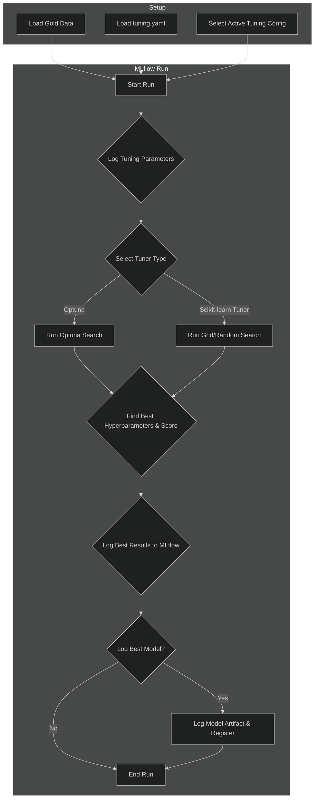

# Hyperparameter Tuning Pipeline

The Hyperparameter Tuning Pipeline is a systematic process for finding the optimal hyperparameters for a given model. It automates the search process using various strategies and leverages MLflow to log and compare the results of different trials.

-   **Source Code:** `src/pipelines/tuning_pipeline.py`
-   **Configuration:** `tuning.yaml`

## Purpose

-   To automate the search for the best model hyperparameters, saving significant manual effort.
-   To support multiple advanced tuning strategies, including Grid Search, Random Search, and Optuna.
-   To provide a flexible configuration-driven approach where new tuning experiments can be defined entirely in YAML.
-   To log every trial and the final best results to MLflow for full traceability and analysis.

## Pipeline Workflow

The pipeline is designed to execute a full tuning experiment within a single, organized MLflow run.



## Key Stages

1.  **Setup & Configuration**:
    -   Loads the training data specified in the CLI command.
    -   Loads the `tuning.yaml` configuration file.
    -   Selects the active tuning experiment to run based on the `model_to_tune` key.
    -   Checks if the selected configuration is `enabled: true`.

2.  **MLflow Run Execution**:
    -   An MLflow run is started with the `run_name` defined in the configuration.
    -   All parameters from the active tuning configuration are logged to MLflow for reproducibility.
    -   Tags are set to identify the model class and tuner type.

3.  **Tuner Selection & Execution**:
    -   The pipeline checks the `tuner_type` and executes the corresponding search strategy.
    -   **For Optuna**: It dynamically constructs a parameter-definer function from the `param_space` dictionary. This allows for defining complex search spaces (with ranges, steps, and distributions) directly in YAML.
    -   **For Scikit-learn Tuners** (`grid`, `random`, etc.): It uses the `param_grid` dictionary, where each hyperparameter is mapped to a list of discrete values to test.
    -   The chosen tuner runs the search using cross-validation.

4.  **Logging Results**:
    -   Once the search is complete, the pipeline logs the following to the active MLflow run:
        -   The best hyperparameters found (`best_...` params).
        -   The best cross-validation score achieved.
    -   If `log_model_artifact: true`, the best-performing model estimator is saved as an artifact.
    -   If `register_model: true`, the saved model is also registered in the MLflow Model Registry.

## Configuration (`tuning.yaml`)

This file is the single source of truth for all tuning experiments. To run a new experiment, you only need to add a new configuration to the `tuning_configs` dictionary and point the top-level `model_to_tune` key to it.

-   **`model_to_tune`**: The key of the configuration to run from `tuning_configs`.
-   **`tuning_configs.<YourTuningConfig>`**:
    -   `enabled`: Set to `true` to run this experiment.
    -   `model_class`: The model to tune (e.g., `XGBRegressor`).
    -   `run_name`: The name for the MLflow run.
    -   `tuner_type`: The core search strategy. See supported tuners below.
    -   `tuner_params`: Parameters for the tuner itself, like `n_trials` for Optuna or `cv` for the cross-validation folds.
    -   `param_space` (for Optuna): A dictionary defining the search space for each hyperparameter.
    -   `param_grid` (for sklearn tuners): A dictionary with lists of exact values to try.

## Supported Tuners

The pipeline supports the following `tuner_type` values:

-   `grid`: Exhaustive Grid Search (`GridSearchCV`).
-   `random`: Randomized Search (`RandomizedSearchCV`).
-   `halving_grid`: Halving Grid Search (`HalvingGridSearchCV`).
-   `halving_random`: Halving Random Search (`HalvingRandomSearchCV`).
-   `optuna`: Bayesian optimization using the Optuna framework.

## How to Run

The pipeline is run from the command line, specifying the training data to use.

**Using CLI Shortcut:**
```bash
run-tuning-pipeline <train_file.parquet>
```

**Example:**
```bash
run-tuning-pipeline train.parquet
```
