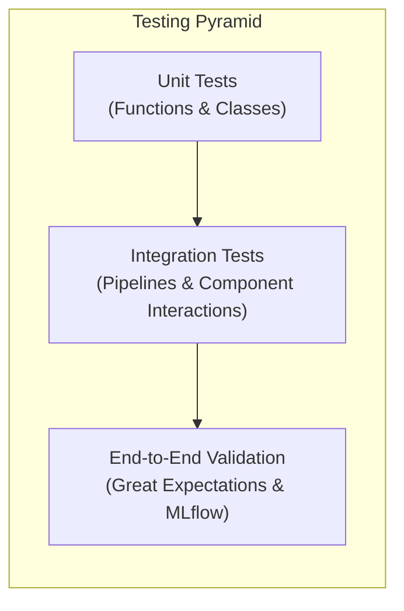

# 🧪 Testing Strategy

This document provides an in-depth analysis of the comprehensive testing strategy for this MLOps project. The strategy is designed to ensure reliability, correctness, and reproducibility across the entire machine learning lifecycle, from data ingestion to model deployment.

## 🎯 Philosophy and Frameworks

The testing philosophy is built on catching errors as early as possible. It ensures:

-   **Data Quality**: Preventing bad data from corrupting pipelines or models.
-   **Code Correctness**: Verifying that all components behave as expected.
-   **Model Performance**: Confirming that models meet performance benchmarks.
-   **Reproducibility**: Ensuring that results can be consistently replicated.

All tests are located in the `tests/` directory and are executed using the **`pytest`** framework. The strategy makes extensive use of `pytest` features like **fixtures** for reusable setup (`conftest.py`), **parametrization** for efficient testing, and **mocking** for component isolation.

## 🔬 The Testing Pyramid in Practice

The project's testing strategy is structured like the classic testing pyramid, with a broad base of fast unit tests, a smaller layer of integration tests, and a peak of end-to-end validation.



### 🥇 Level 1: Unit Tests (The Foundation)

-   **Purpose**: To verify the correctness of the smallest units of code—individual functions and classes—in complete isolation.
-   **Location**: `tests/test_data_ingestion/`, `tests/test_data_preprocessing/`, `tests/test_gold_data_preprocessing/`

#### Key Implementations:

1.  **Testing Data Loaders (`test_data_loader.py`)**:
    -   Uses `@pytest.mark.parametrize` to efficiently test that the `load_data` function can correctly handle multiple file formats (`csv`, `json`, `parquet`, etc.).
    -   Leverages a custom fixture (`create_test_file`) to generate temporary files on the fly for each test run.

2.  **Testing Preprocessing Functions (`test_silver_preprocessing.py`)**:
    -   Each data cleaning and feature engineering function (e.g., `standardize_column_format`, `create_date_features`) is tested individually.
    -   A shared `pytest` fixture provides a messy, realistic DataFrame to ensure the functions are robust.

3.  **Testing Custom Transformers (`test_gold_data_preprocessing/`)**:
    -   This is a cornerstone of the unit testing strategy. Each custom `scikit-learn`-compatible transformer (e.g., `CategoricalEncoder`, `OutlierTransformer`, `Scaler`) has its own dedicated test file.
    -   Tests are exhaustive and cover:
        -   Correct initialization and configuration.
        -   The mathematical correctness of the `fit` and `transform` methods.
        -   Graceful handling of edge cases, such as unseen categories during transformation.
        -   State persistence via `save()` and `load()` methods.
        -   Error handling for incorrect usage (e.g., calling `transform` before `fit`).

### 🥈 Level 2: Integration Tests

-   **Purpose**: To verify the interaction and data flow between multiple components or entire sub-systems.
-   **Location**: `tests/test_pipelines/`, `tests/test_data_split/`, `tests/test_prediction_server/`

#### Key Implementations:

1.  **Pipeline Orchestration Tests (`test_pipelines/`)**:
    -   These tests verify the *control flow* of the data pipelines without performing slow computations.
    -   They use extensive mocking (`@patch`) to replace heavy functions (like data loading or GE validation) with lightweight spies.
    -   The tests assert that the pipeline script calls the correct functions in the correct order and correctly handles success or failure from the mocked components.

2.  **Data Splitting Logic (`test_data_split.py`)**:
    -   This is a critical integration test that verifies the chronological data split.
    -   It uses `tmp_path` and `monkeypatch` to create a fully isolated, temporary file system. This ensures the test is hermetic and does not touch the actual project data.
    -   Assertions confirm not only that the files are created with the correct number of rows but also that the **chronological order is maintained** between splits, preventing data leakage.

3.  **Prediction Server Logic (`test_predict.py`)**:
    -   This tests the integration of all preprocessing steps within the context of a prediction request.
    -   It verifies that the `preprocessing_for_prediction` function correctly orchestrates calls to all the fitted transformers in the right sequence, ensuring the API can successfully transform raw input into a model-ready feature vector.

### 🥉 Level 3: End-to-End Validation

-   **Purpose**: To validate the entire workflow, from raw data to model performance, in a production-like manner.
-   **Implementation**: These are not traditional `pytest` tests but are integrated directly into the MLOps workflow.

#### Key Implementations:

1.  **Data Validation with Great Expectations**:
    -   **What it is**: Live data quality gates embedded within each DVC pipeline stage (`bronze`, `silver`, `gold`).
    -   **How it works**: After data is transformed in a pipeline stage, a Great Expectations checkpoint is run against it. If the data does not meet the predefined expectations (e.g., schema adherence, value ranges, distribution checks), the data is automatically quarantined, and the pipeline fails.
    -   **Reports**: Detailed HTML reports are generated, allowing for quick debugging of data quality issues.

2.  **Model Performance Validation in MLflow**:
    -   **What it is**: The final validation of the trained model's performance and generalization capabilities.
    -   **How it works**: The `training_pipeline.py` script runs evaluations on the hold-out test set and performs time-based cross-validation. All performance metrics (RMSE, MAE, R²), evaluation plots, and model artifacts are logged to **MLflow**.
    -   **The "Test"**: The test is the manual or automated review of the MLflow run. A successful run is one where the model's performance on the validation and test sets meets the project's business objectives.

## ▶️ How to Run Tests

-   **Run all tests**:
```bash
pytest
```

-   **Run tests for a specific directory**:
```bash
pytest tests/test_gold_data_preprocessing/
```

-   **Run a specific test file**:
```bash
pytest tests/test_data_split/test_split_data.py
```