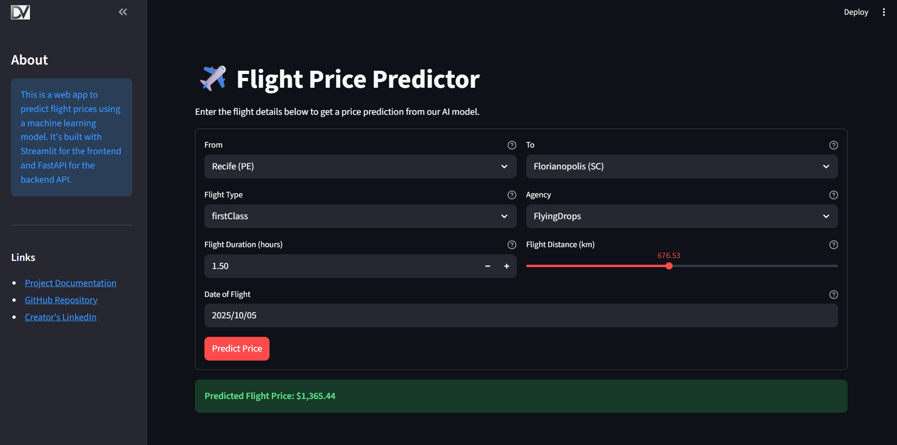

# 🖥️ Frontend User Interface

This project includes an interactive web application built with **Streamlit** that serves as a user-friendly interface for the flight price prediction API.

-   **Source Code:** `frontend_streamlit/app.py`

## 🎯 Overview

The Streamlit application provides a simple web form where users can input flight details. It then calls the deployed FastAPI prediction server, retrieves the prediction, and displays the result to the user in real-time.



## 🚀 How to Run the Frontend

To run the Streamlit application locally, follow these steps:

1.  **Ensure API is Running**: The frontend requires the prediction API to be running and accessible. You can run the API locally via Docker or connect to a deployed version.

2.  **Configure the API URL**: The Streamlit app is configured using an environment variable. Create a file named `.env` in the `frontend_streamlit/` directory:

    ```ini
    # frontend_streamlit/.env
    API_URL=http://127.0.0.1:9000/prediction
    ```
    *Replace the URL with your deployed API endpoint if you are not running it locally.*

3.  **Run the App**: From the project's root directory, execute the following command:

    ```bash
    streamlit run frontend_streamlit/app.py
    ```

The application will open in your web browser.

## ⚙️ Configuration

The application's behavior is controlled by environment variables:

-   `API_URL`: The full URL for the prediction endpoint of the backend API. The app defaults to `http://127.0.0.1:9000/prediction` if this variable is not set.

When deploying to **Streamlit Community Cloud**, set `API_URL` in the application's **Secrets** instead of using a `.env` file.