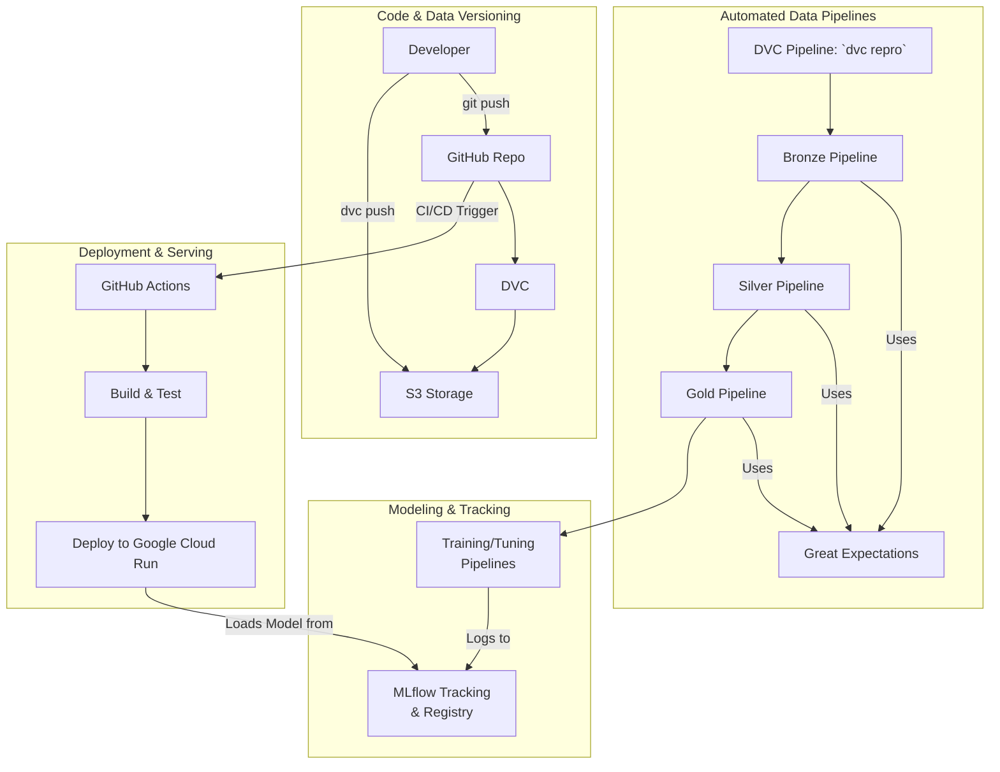

# ✈️ Flight Price Prediction: An MLOps Project

Welcome to the official documentation for the Flight Price Prediction project. This project is a comprehensive, end-to-end MLOps pipeline for predicting flight prices, designed to be reproducible, automated, and robust.

This documentation serves as a central hub for all project artifacts, analysis, and reports, guiding you through the entire lifecycle from data to deployment.

---

## 🏛️ Project Architecture

The architecture is designed to be modular and scalable. The primary method of orchestration is **DVC pipelines**, which define and connect all stages of data processing and model training.

*For a deeper dive, see the full [Architecture Documentation](MLOps/architecture.md).*

---

## 🗺️ Navigating the Documentation

This project is documented across several key areas. Here’s a recommended reading path to understand the project from the ground up:

1.  **The "Why": Business Objective & Data Insights**
    *   **[Exploratory Data Analysis (EDA)](EDA/flights_eda.ipynb)**: Understand the business case and discover the key patterns and insights that drive our modeling strategy.

2.  **The "How": System Design & Pipelines**
    *   **[MLOps Architecture](MLOps/architecture.md)**: A high-level look at the tools and workflows that power this project.
    *   **[Data Pipelines](Data Pipelines/data_pipelines.md)**: Learn about the Medallion architecture (Bronze, Silver, Gold) used to process and validate the data.
    *   **[Modeling Pipelines](Modeling/training_pipeline.md)**: See how models are trained, tuned, and evaluated systematically.
    *   **[Continuous Integration (CI)](CI/ci.md)**: See how the project is automatically tested and validated.
    *   **[Continuous Deployment (CD)](CD/cd.md)**: Learn how the model is automatically deployed to production.

3.  **The "What": Model & API**
    *   **[Model Selection Report](Modeling/model_selection_report.md)**: Follow the journey of how the champion model was chosen, including the investigation into an over-performing initial model.
    *   **[Champion Model Deep Dive](Modeling/model_explainability_lgbm_champ.md)**: An in-depth analysis of the final LightGBM model's behavior using SHAP.
    *   **[API Reference](API/api_reference.md)**: Detailed documentation for the production-ready FastAPI prediction server, including deployment to Google Cloud.

4.  **The "Tools": MLOps Stack**
    *   **[Tooling Overview](MLOps/tools.md)**: A summary of all the MLOps tools used and their roles in the project.

---

## 🛣️ Roadmap & Future Work

This project provides a solid foundation for a production-ready MLOps workflow. The following steps outline a roadmap for enhancing its capabilities to a more advanced, enterprise-grade level:

1.  **Advanced Orchestration with Apache Airflow**
    *   **Current State**: Pipelines are orchestrated manually via `dvc repro`.
    *   **Next Step**: Implement the existing Airflow DAGs (`airflow/dags`) to run the DVC pipelines on a schedule. This enables automated, time-based retraining and data processing, moving from a manual trigger to a true production orchestrator.

2.  **Advanced CI/CD Workflows**
    *   **Current State**: CI validates the pipeline and CD deploys the API on new tags.
    *   **Next Step**: Enhance the CD workflow to include automated integration tests against the deployed API. Implement a "staging" environment to automatically deploy PRs for review before merging to `main`.

3.  **Comprehensive Monitoring**
    *   **Data & Model Drift**: Integrate tools like **Evidently AI** or **NannyML** to monitor for statistical drift in input data and degradation in model performance over time.
    *   **Prediction Monitoring**: Implement logging and alerting for the prediction API to track request latency, error rates, and the distribution of incoming prediction data.
    *   **Dashboarding**: Create dashboards (e.g., using Grafana or a BI tool) to visualize model performance metrics, data drift reports, and API health.

4.  **Advanced Model Deployment & Management**
    *   **A/B Testing & Shadow Deployment**: Enhance the deployment strategy to allow for A/B testing new models against the production champion or deploying models in a "shadow" mode to monitor their predictions without affecting users.
    *   **Automated Model Promotion**: Create a workflow (potentially in MLflow or via CI/CD) to automatically promote a model from "Staging" to "Production" in the MLflow Model Registry if it passes all evaluation and validation criteria.

