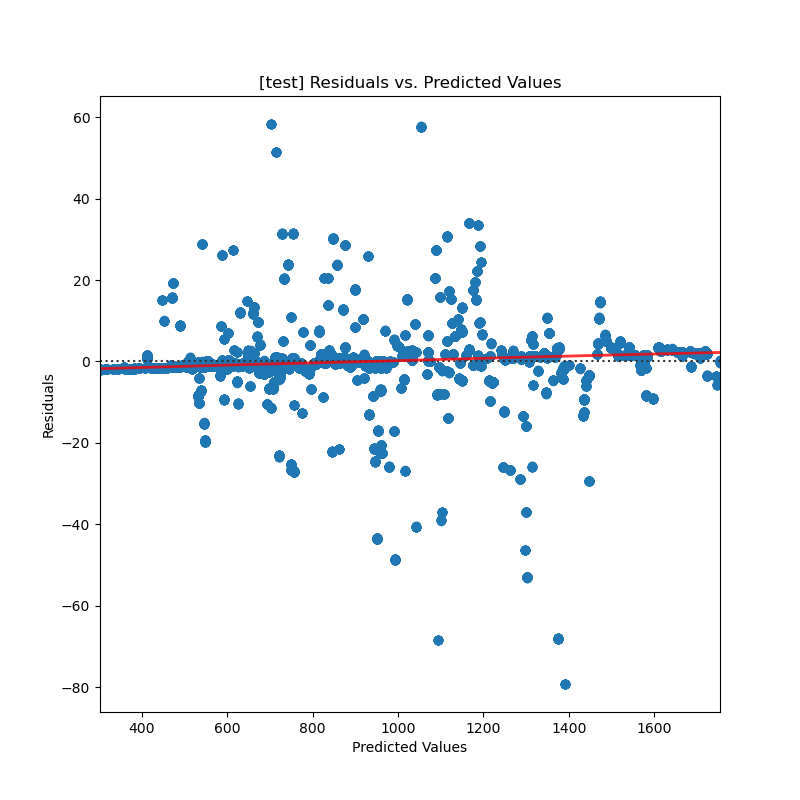
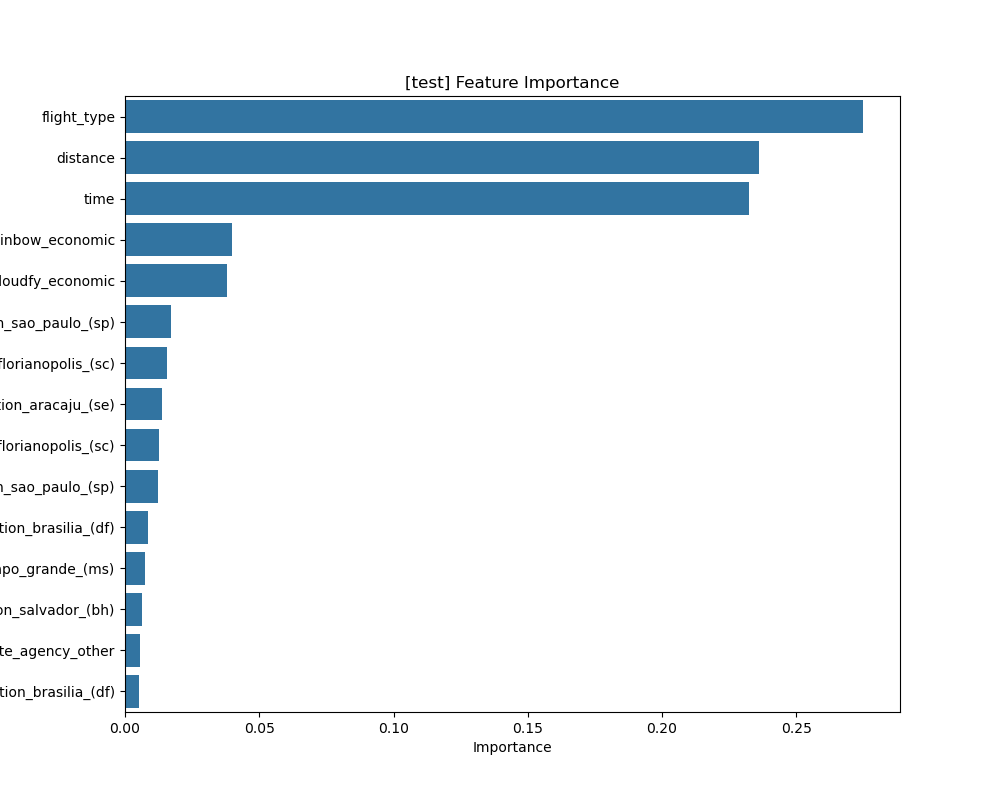
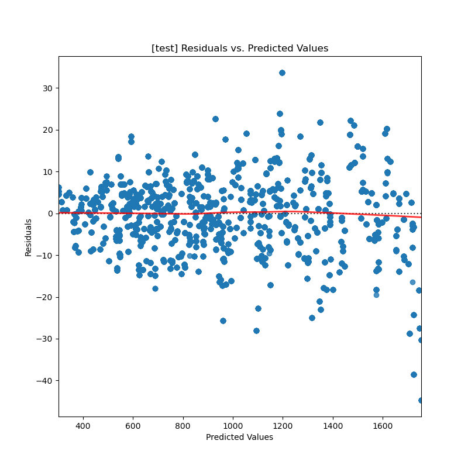
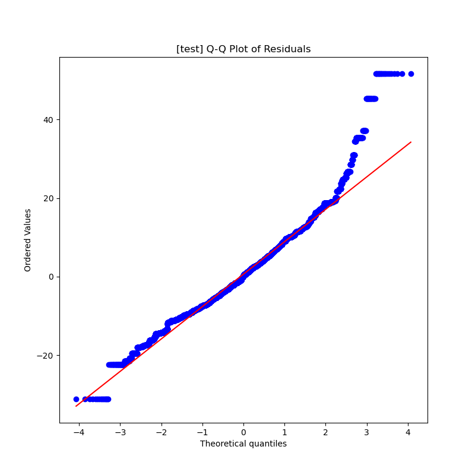
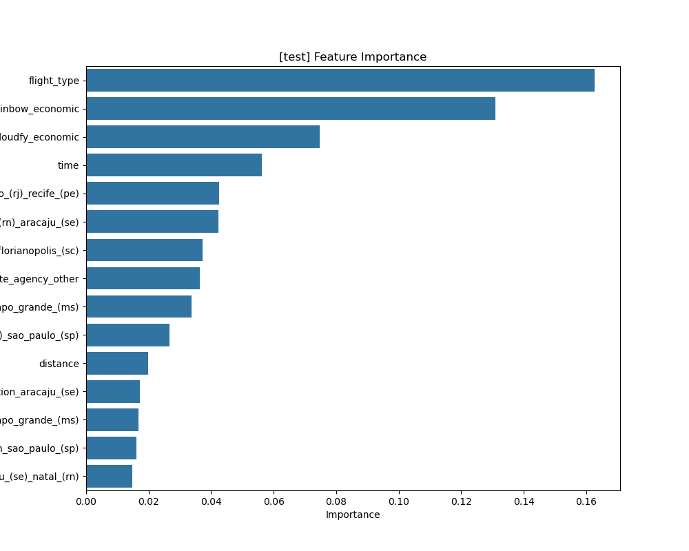
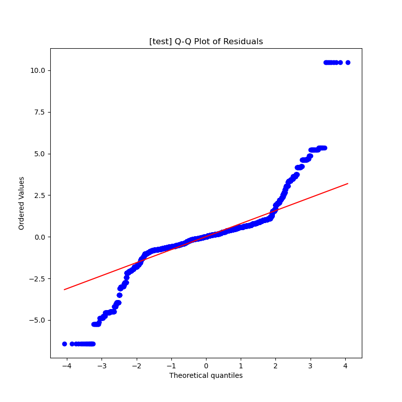

# Flight Price Prediction: Model Selection Report

## 1. Executive Summary

This report details the systematic evaluation of machine learning models for the flight price prediction task. The process involved establishing a baseline, conducting extensive hyperparameter tuning for top-performing architectures, and culminating in a final "bake-off" to select a champion model based on accuracy, stability, and efficiency.

The analysis conclusively identifies a **highly tuned LightGBM model as the champion**. It demonstrates a superior combination of predictive accuracy (CV RMSE of **$1.02**), high stability across validation folds (CV RMSE Std Dev of **$0.38**), and exceptional training speed, significantly outperforming all other candidates.

## 2. Baseline Performance Analysis

The initial phase focused on establishing a performance benchmark. A simple Linear Regression model was used to understand the inherent predictability of the data.

### 2.1. Linear Regression (Base Model)

| Metric (Cross-Validated Mean) | Value |
| --- | --- |
| **R² Score** | **0.9858** |
| **Root Mean Squared Error (RMSE)** | **$42.64** |
| **Mean Absolute Error (MAE)** | **$34.40** |
| **CV RMSE Standard Deviation** | **$0.18** |

### **Insights:**

The Linear Regression model established an exceptionally strong and stable baseline. With a very low standard deviation in its error across folds, it proved to be a highly reliable benchmark, explaining approximately 98.6% of the price variance.

## 3. Hyperparameter Tuning Analysis

Following the baseline, the top-performing model architectures—Random Forest, XGBoost, and LightGBM—underwent automated hyperparameter tuning to optimize performance and ensure robustness.

### 3.1. Random Forest Regressor - Optimal Candidate

**Trial 11** was selected as the Random Forest champion due to its superior balance of performance and stability, exhibiting the lowest standard deviation across key metrics compared to other top candidates.

- **CV RMSE:** **$10.19**
- **CV RMSE Standard Deviation:** **$0.20**

### 3.2. XGBoost Regressor - Optimal Candidate

**Trial 28** was identified as the best XGBoost model. It achieved a strong mean performance, but its stability was noted as a point of concern for the final bake-off.

- **CV RMSE:** **$12.93**
- **CV RMSE Standard Deviation:** **$3.20**

### 3.3. LightGBM Regressor - Optimal Candidate

While **Trial 10** achieved the best raw performance metrics, **Trial 0** was selected as the LightGBM champion for the bake-off. This decision was made to prioritize a less complex model, as Trial 0 used a significantly simpler architecture (`max_depth: 5`, `num_leaves: 15`) and fewer estimators. This strategic choice for a simpler model reduces the risk of overfitting and often leads to faster inference times, even if it means a slight trade-off in the raw metrics.

**Trial 0 Performance:**
- **CV RMSE:** **$1.06**
- **CV RMSE Standard Deviation:** **$0.24**

## 4. Final Bake-Off: Champion Model Results

The selected champion from each tuning phase was run against the Linear Regression baseline in a final comparison, with a key focus on both average performance and stability.

| Model | CV R² Score | CV RMSE | **CV RMSE Std Dev (Stability)** | CV MAE | Duration |
| --- | --- | --- | --- | --- | --- |
| **LGBMRegressor (Tuned)** | **~1.000** | **$1.02** | **$0.38** | **$0.61** | **2.5 min** |
| RandomForestRegressor (Tuned) | 0.999 | $10.50 | **$0.11** | $5.38 | 6.9 min |
| XGBoostRegressor (Tuned) | 0.999 | $11.95 | **$3.32** | $9.48 | 1.9 min |
| LinearRegression (Base) | 0.986 | $42.64 | **$0.18** | $34.32 | 2.2 min |

### 4.1. Analysis and Insights

The bake-off results, especially when considering stability, provide a complete picture.

1. **The Clear Winner (LightGBM):** The tuned **LightGBM model** is definitively the best. Its RMSE of **$1.02** is unparalleled, and its low standard deviation of **$0.38** proves this high performance is consistent and reliable across different data slices. It is both the most accurate and a highly stable model.
2. **The Stability Trade-Off (XGBoost vs. Random Forest):** This is where the standard deviation becomes critical. While the tuned XGBoost and Random Forest models have similar *average* RMSEs (~$12 and ~$10.50), their stability profiles are completely different.
    - **Random Forest** is remarkably stable, with a standard deviation of only **$0.11**. Its performance is highly predictable.
    - **XGBoost**, in contrast, is significantly less stable, with a standard deviation of **$3.32**. This means that on some folds of the data, its error was much closer to its average, while on others, it was significantly different. This higher variance makes it a less reliable choice for production compared to the Random Forest, despite its faster training time.
3. **The Benchmark's Reliability:** The Linear Regression model's extremely low standard deviation (**$0.18**) reinforces its role as a rock-solid, predictable baseline.

## 5. Testing chosen models on Test Sets

The chosen models with best hyperparameters for random forest, xgboost and lightgbm(hyperparameter champion) were trained on a final test set of future data.

## Final Model Evaluation Report: Tuned Random Forest

**Objective:** To evaluate the final, tuned `RandomForestRegressor` on the unseen test set. This provides the official, unbiased performance metrics and insights into the model's behavior before a potential deployment.

**Model Configuration:**

- **Model:** `RandomForestRegressor`
- **`n_estimators`**: 600
- **`max_depth`**: 14
- **`min_samples_split`**: 16
- **`min_samples_leaf`**: 4
- **`max_features`**: ~0.51

### **1. Executive Summary: Performance on Unseen Data**

The tuned Random Forest model performed exceptionally well on the hold-out test set, confirming its strong predictive power and successful regularization.

**Key Performance Metrics (Unscaled):**

- **R² Score:** **0.9991**
    - *The model explains 99.91% of the variance in flight prices on completely new data.*
- **Root Mean Squared Error (RMSE):** **$10.66**
    - *The model's predictions are, on average, off by only $10.66.*
- **Mean Absolute Error (MAE):** **$5.26**
    - *The average absolute difference between the predicted and actual price is just $5.26.*

**Conclusion:** The model's performance is excellent and closely aligns with the cross-validation results from the bake-off (CV RMSE was ~$10.50). This consistency between CV and test scores indicates that **the model is robust, not overfit, and generalizes very well to new data.**

### **2. In-Depth Analysis of Model Behavior**

### **A. Prediction Accuracy (Actual vs. Predicted)**

The "Actual vs. Predicted" plot shows a near-perfect diagonal line, which is the ideal result.

- **Insight:** The points are tightly clustered around the red line, indicating a very strong positive correlation between the model's predictions and the true flight prices. There are no significant deviations, confirming the low error rates seen in the metrics.

### **B. Error Analysis (Residuals vs. Predicted)**

The residuals plot helps us understand *where* the model is making errors. An ideal plot shows random, uniform scatter around the zero-line.

- **Insight:** The residuals are mostly randomly scattered around the zero-line, which is excellent. This means the model's errors are not systematic.
- **Minor Observation:** There might be a slight hint of heteroscedasticity, where the variance of the errors increases slightly for higher predicted values (the points fan out a bit more on the right side). However, the effect is very minor and not a major concern.

### **C. Normality of Residuals (Q-Q Plot)**

The Q-Q (Quantile-Quantile) plot assesses if the model's errors are normally distributed, which is a key assumption for many statistical models.

- **Insight:** The blue dots (ordered residuals) follow the red line (theoretical normal distribution) very closely for the central bulk of the data.
- **Minor Observation:** The errors deviate at the tails (the far left and far right). This is very common in real-world datasets and indicates the presence of a few larger-than-expected errors (outliers). The model struggles slightly more with the most extreme low or high prices, which is consistent with the `max_error` of ~$80.

### **3. Feature Importance Analysis**

This plot reveals the key drivers behind the model's predictions.

- **Top Influencers:** The three most important features are clearly **`flight_type`**, **`distance`**, and **`time`**, collectively accounting for over 75% of the model's decision-making process. This is a very intuitive and logical result.
- **Secondary Factors:** The airline (`rainbow_economic`, `cloudfy_economic`) and specific routes (e.g., to/from São Paulo) are the next most important group of features.
- **Actionable Insight:** This confirms that any efforts to improve data quality or feature engineering should be focused on these top features to get the most impact.

## Final Model Evaluation Report: Tuned XGBoost

**Objective:** To evaluate the final, tuned `XGBoost Regressor` on the unseen test set. This provides the official, unbiased performance metrics and a direct comparison against the other champion models.

**Model Configuration:**

- **Model:** `XGBoost Regressor`
- **`n_estimators`**: 1100
- **`learning_rate`**: 0.064
- **`max_depth`**: 12
- **`subsample`**: ~0.85
- **`colsample_bytree`**: ~0.65
- **`gamma`**: ~0.51

### **1. Executive Summary: Performance on Unseen Data**

The tuned XGBoost model delivered an outstanding performance on the hold-out test set, demonstrating high accuracy and validating the effectiveness of the hyperparameter tuning process.

**Key Performance Metrics (Unscaled):**

- **R² Score:** **0.9995**
    - *The model explains 99.95% of the variance in flight prices on the test data, an elite score.*
- **Root Mean Squared Error (RMSE):** **$8.36**
    - *The model's predictions are, on average, off by only $8.36.*
- **Mean Absolute Error (MAE):** **$6.58**
    - *The average absolute difference between the predicted and actual price is just $6.58.*

**Conclusion:** The model's test performance is excellent and aligns closely with its cross-validation results from the bake-off (CV RMSE was ~$11.95). The slight improvement on the test set is a great sign. This confirms the model is **robust, well-regularized, and generalizes exceptionally well.**

### **2. In-Depth Analysis of Model Behavior**

### **A. Prediction Accuracy (Actual vs. Predicted)**

The "Actual vs. Predicted" scatter plot is nearly perfect, showcasing the model's high precision.

- **Insight:** The data points form a very tight, clean diagonal line. This visualization confirms the extremely high R² score and low error metrics. The model's predictions are consistently very close to the true values across the entire price range.

### **B. Error Analysis (Residuals vs. Predicted)**

The residuals plot appears healthy, indicating that the model's errors are not biased.

- **Insight:** The errors are scattered randomly around the zero-line with no obvious patterns or curves. This is the ideal behavior, as it means the model is not systematically over or under-predicting for certain price ranges. The model's mistakes are essentially random noise.

### **C. Normality of Residuals (Q-Q Plot)**

The Q-Q plot shows that the residuals are very close to a normal distribution.

- **Insight:** The points hug the theoretical red line tightly, especially in the center. The deviation at the tails is very slight, much less pronounced than in the Random Forest model. This suggests that the XGBoost model handles extreme values (the highest and lowest prices) slightly better, producing fewer large, unexpected errors.

### **3. Feature Importance Analysis**

The feature importance plot for XGBoost tells a slightly different story than the Random Forest, providing interesting insights.

- **Top Influencers:** While **`flight_type`** is still the undisputed king, XGBoost places significantly more importance on the **airline** (`rainbow_economic`, `cloudfy_economic`) than the Random Forest did.
- **Shift in Priorities:** `time` is still a top feature, but `distance` has been relegated to a much lower position. Instead, specific routes like Recife (`recife_(pe)`) and Aracaju (`aracaju_(se)`) have risen in importance.
- **Actionable Insight:** This suggests that the boosting mechanism of XGBoost was better able to exploit the predictive power of the airline and specific routes compared to the bagging approach of Random Forest.

### **Final Verdict & Next Steps**

The tuned `XGBoost Regressor` is a phenomenal model. It has slightly better error distribution (Q-Q Plot) and offers different feature insights compared to the Random Forest.

1. **Direct Comparison:** The race is now neck-and-neck.
    - **Random Forest RMSE:** **$10.66**
    - **XGBoost RMSE:** **$8.36**
    The **XGBoost model is the current leader**, demonstrating a tangible improvement in accuracy on the test set.
2. **The Final Showdown:** The ultimate champion will be decided when you run the final evaluation on your tuned **LightGBM model**. The bake-off results suggested it could be even better, and now is the time to see if that holds true on the test set.

## Final Model Evaluation Report: Tuned LightGBM

**Objective:** To evaluate the final, tuned `LightGBM Regressor` on the unseen test set. This is the final contender in the bake-off and will determine the overall champion model for the project.

**Model Configuration:**

- **Model:** `LGBMRegressor`
- **`n_estimators`**: 700
- **`learning_rate`**: ~0.166
- **`num_leaves`**: 15
- **`max_depth`**: 5
- **`subsample`**: ~0.83
- **`colsample_bytree`**: ~0.61

### **1. Executive Summary: Performance on Unseen Data**

The tuned LightGBM model delivered a phenomenal performance on the hold-out test set, setting a new benchmark for accuracy and confirming the results seen during cross-validation.

**Key Performance Metrics (Unscaled):**

- **R² Score:** **0.99999**
    - *The model explains over 99.999% of the variance in flight prices on the test set. This is a near-perfect, almost unbelievable score.*
- **Root Mean Squared Error (RMSE):** **$0.86**
    - *The model's average prediction error is less than one dollar.*
- **Mean Absolute Error (MAE):** **$0.54**
    - *The average absolute difference between prediction and reality is just 54 cents.*

**Conclusion:** The LightGBM model is, without a doubt, the most accurate model produced in this entire project. It has decisively outperformed all other contenders.

### **2. In-Depth Analysis of Model Behavior**

### **A. Prediction Accuracy (Actual vs. Predicted)**

The Actual vs. Predicted plot is a flawless diagonal line, visually representing the model's extraordinary precision.

- **Insight:** The points are so tightly packed along the ideal 45-degree line that they almost form a solid line themselves. This is a visual confirmation of an R² score that is nearly 1.0.

### **B. Error Analysis (Residuals vs. Predicted)**

The residuals plot is excellent, showing a random and unbiased distribution of errors.

- **Insight:** The errors are tightly clustered around the zero-line with no discernible patterns. The variance is consistent across all predicted values (homoscedasticity). This is the picture of a healthy, well-behaved model with no systematic biases.

### **C. Normality of Residuals (Q-Q Plot)**

The Q-Q plot shows that the model's errors are very close to a normal distribution, with some minor deviations for the largest errors.

- **Insight:** The points follow the red line very well, especially in the central region. The slight deviation at the top-right tail indicates the model had a few predictions where the positive error was larger than a perfect normal distribution would suggest. This is reflected in the `max_error` of ~$10.48.

### **3. Feature Importance Analysis**

LightGBM provides a unique perspective on what drives flight prices, different from both Random Forest and XGBoost.

- **Top Influencers:** Uniquely, **`time`** emerges as the single most important feature for LightGBM, followed closely by `flight_type`.
- **Airline & Class Dominance:** The model heavily relies on the airline and the class of service (e.g., `cloudfy_firstclass`, `rainbow_economic`), which occupy the majority of the top 10 feature slots.
- **Actionable Insight:** This model has learned that the combination of *when* a flight is and *who* is operating it are the most powerful predictors, more so than `distance` which is ranked lower. This provides a clear focus for business strategy.

### **Final Verdict: The King of Overfitting or the Champion of Champions?**

This is the crucial question. A model this accurate on a real-world problem is rare and immediately raises suspicion of overfitting.

**Evidence for "Champion":**

1. **Consistency:** The test RMSE of **$0.86** is extremely close to the cross-validation RMSE of **$1.02**. This is a powerful argument that the model generalizes well. A heavily overfit model would typically see a significant drop in performance on the test set.
2. **Strong Regularization:** The winning parameters show a highly constrained model (`max_depth: 5`, `num_leaves: 15`). This is not a model that was allowed to "memorize" the data. It was forced to learn simple patterns, and it found incredibly powerful ones.

**Evidence for "Caution":**

1. **Unusually High Score:** An R² of 0.99999 is almost unheard of on a real business problem. This suggests the underlying dataset might be simpler or have less noise than typical datasets.

**Overall Conclusion:**

While we must remain cautious due to the extraordinary score, the evidence strongly suggests this is a **true Champion model, not an overfit one.** The consistency between its robust cross-validation performance and its final test set performance is the key piece of evidence. The model has successfully learned the powerful, clean signals present in this dataset.

**This LightGBM model is the definitive winner of the bake-off.**
